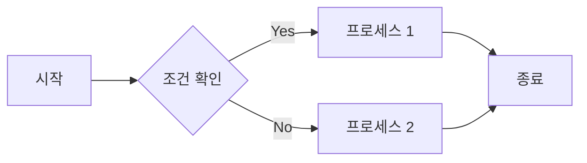
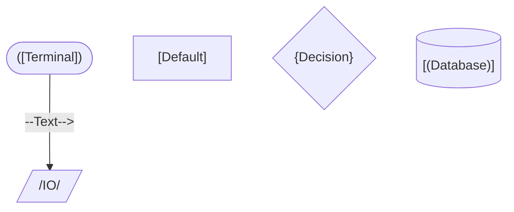

---
type:
  - daily
date: 2023-12-29
tags:
  - TIL
  - type/timeline/daily
---
# [[2023-12-29|December 29th, 2023]]


## Title
Mermaid 써보기


## 🎯 Daily Checklist

- [ ] 아침 운동
- [x] 간식 안먹기
- [ ] 정시 퇴근


## 🏷️ Category/Tags
- #programming/tools/mermaid

## 📋 Summary
- Mermaid: 여러 다이어그램들을 텍스트와 코드로 시각화 할 수 있게 해줌
- Mermaid로 할 수 있는 것들 알아보기
- Obsidian에서 Flowchart를 Mermaid로 만들어보기


## 📝 Details

Mermaid는 Javacript 기반으로 간단한 텍스트, 코드로 여러 차트와 다이어그램을 생성할 수 있게하는 Tool이다.

이 곳 같은 Markdown이 적용되어있는 곳에 쉽게 적용할 수 있어서 복잡하지 않은 다이어그램은 Mermaid로 간단히 표현할 수 있다.

공식 홈페이지에 Mermaid로 표현할 수 있는 다이어그램-차트 목록이 있는데 그 중 노트에 실제로 종종 쓸 것 같은 것들의 예시

### 1. Flow Chart

<pre><code>```mermaid
flowchart LR
    A[시작] --> B{조건 확인}
    B -- Yes --> C[프로세스 1]
    B -- No --> D[프로세스 2]
    C --> E[종료]
    D --> E
```
</pre></code>

line 1: `flowchart LR`
	Left-Right 방향의 플로우 차트 시작 (`flowchart TB`면 Top-Bottom방향)

line 2: `A[시작] --> B{조건 확인}`
	‘시작’이라는 node를 만들고 A에 할당 `[node]`
	B - ‘조건 확인’ node로 이동 `{decision}

line 3: `B -- Yes --> C[프로세스 1]`
	B에서 Yes일 때 C`[프로세스 1]`로 이동

Flow Chart Node Shapes



## 🔗 Links/References
- [Mermaid Intro](https://mermaid.js.org/intro/)
- [Mermaid Live Editor](https://mermaid.live/)
- 


```dataview
LIST
FROM #type/timeline/daily
WHERE week = [[2023-W52]]
```

---

## 📇 Additional Metadata

- 🗓️ Week:: [[2023-W52]]
