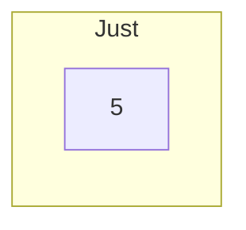
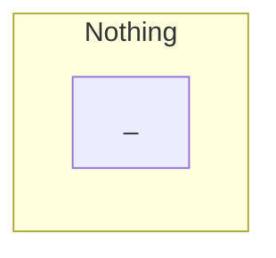
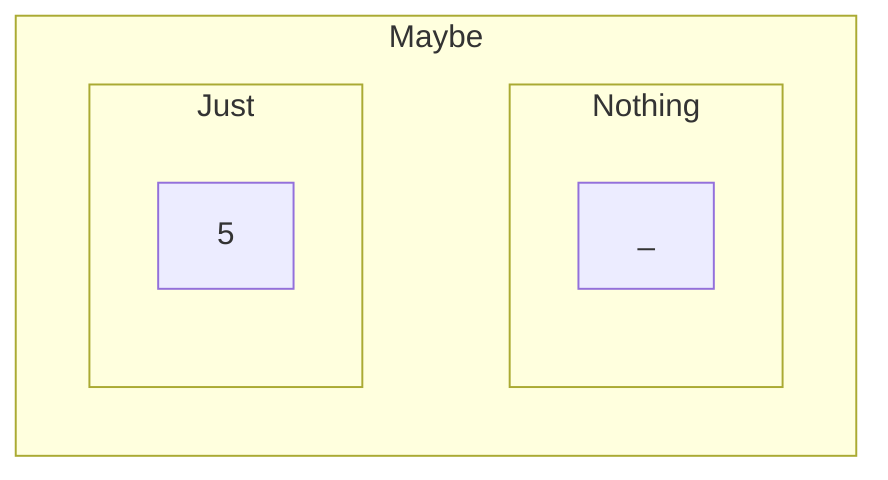
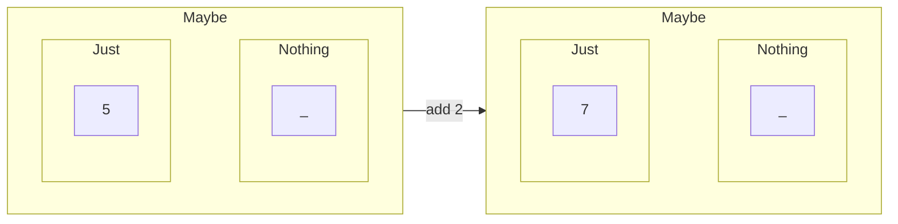

---
type:
  - daily
date: 2023-12-30T18:00:13
tags:
  - TIL
  - type/timeline/daily
---
# [[2023-12-30|December 30th, 2023]]


## Title
함수형 프로그래밍 인트로 - Maybe(Optional)


## 🎯 Daily Checklist

- [x] 아침 운동
- [x] 간식 안먹기
- [ ] 정시 퇴근


## 🏷️ Category/Tags
- #programming/fp


## 📋 Summary
- 함수형 프로그래밍 개념 정리 시작
- 첫 번째로 Maybe를 Typescript 기반으로 정리


## 📝 Details

함수형 프로그래밍이 궁금해서 찾아보다보면 일단 용어부터 낯설어서 거부감이 생기는데 일단 그런 이론적인 용어들을 최소화하고 이미 알고 있는 것에서부터 시작하여 차근차근 알아보자

### Optional(Maybe)

결국 목적은 어떠한 값이 있을 수도 있고 없을 수도 있는 상황을 안전하게 처리하자는 것이다. Java에서 NullPointerException이나 JS에서 uncaught reference error의 악몽에서 벗어나기 위해 조금 더 자세히 알아보자.


먼저 우리가 필요한 어떤 값(value)을 상자에 담는 것으로 시작하자.


5라는 값을 Just라는 상자에 담았다.

만약에 값이 존재하지 않을 경우엔 그 상태를 우리는 Nothing이라는 빈 상자라고 하자.

> [!warning] “0” 값을 가지는 것이 아니라 Null이다.

그리고 이제 이 값이 있거나(Just) 없을때(Nothing)의 상황들을 ==Maybe== 라는 큰 상자로 관리해보자.

이것이 Maybe(Optional)의 특징 중 하나인 값의 포장(Wrapping Values)이다.



> [!note]
> Wrapping Values 
> - Value를 Wrapping하고, value가 없을 경우 null이 아니라 비어있는 상자(Nothing)를 참조하여 Null-safe한 작업 가능


이제 이 Maybe를 가지고 연산을 해보자.



Maybe 상자에 add 2 라는 함수를 적용해 새로운 Maybe 상자를 얻었습니다.

상자안에 값이 있다면 그 값에 add 2 함수가 적용된 값이 들어있고 Nothing box라면 연산 이후에도 여전히 Nothing box입니다.

Null check 코드를 집어넣지 않고 Maybe로 값을 감싸 필요한 연산을 일관적으로 수행할 수 있습니다.

개념적인 부분은 여기까지 알아보고 이제 code로 만들어보자.

### Typescript로 Maybe 만들어보기

```ts
abstract class Maybe<T> {
	abstract bind<U>(func: (value: T) => Maybe<U>): Maybe<U>;
}
```

Maybe라는 추상클래스에 추상메소드인 bind를 가지고있다.
bind는 함수를 받아서 현재 Maybe에 해당 함수가 적용 된 새로운 Maybe를 return 한다.

그럼 이 Maybe를 구현한 Just와 Nothing class도 만들어보자.

```ts
class Just<T> extends Maybe<T> {

	constructor(private value: T) {
		super();
	}

	bind<U>(func: (value: T) => Maybe<U>): Maybe<U> {
		return func(this.value);
	}
}
```

Just는 ==value==라는 private 프로퍼티를 가지고 ==bind==는 value에 인자로 받은 func를 적용한 뒤 새로운 Maybe를 리턴합니다.

Nothing은 더 간단합니다.
```ts
class Nothing<T> extends Maybe<T> {

	bind<U>(func: (value: T) => Maybe<U>): Maybe<U> {
		return new Nothing<U>();
	} 
}
```

비어있는 상자니까 당연히 value는 없고 bind는 항상 새로운 Nothing을 리턴합니다. 

그럼 이제 bind에 실제 함수를 넣어봅시다.

일단 위의 예시에서 사용한 add 2를 넣어보죠.

그전에 Maybe를 쉽게 만들기 위해 static method를 하나 추가하겠습니다.

```ts
abstract class Maybe<T> {
	abstract bind<U>(func: (value: T) => Maybe<U>): Maybe<U>;

	static of<T>(value: T | undefined | null): Maybe<T> {
		return (value === undefined || value === null)
			? new Nothing() : new Just(value);
	}
}
```

그리고 add 2를 만들고
```ts
const add2 = (value: number) => Maybe.of(value + 2);
```

Maybe instance에 bind를 적용합시다.

```ts
const maybeNumber = Maybe.of<number>(5);

const addedNumber = maybeNumber.bind(add2);

console.log(addedNumber); // Just: { "value": 7 }
```

Nothing인 경우도 살펴봅시다.
```ts
const maybeNumber = Maybe.of<number>(null);

const addedNumber = maybeNumber.bind(add2);

console.log(addedNumber); // Nothing: {}
```

한번만 하면 아쉬우니까 2개의 함수를 bind 시켜봅시다.
```ts
const add2   = (value: number) => Maybe.of(value + 2);
const double = (value: number) => Maybe.of(value * 2);

const five_add2_and_double = Maybe.of<number>(5).bind(add2).bind(double);
const null_add2_and_double = Maybe.of<number>(null).bind(add2).bind(double);

console.log(five_add2_and_double); // Just: { "value": 14 }
console.log(null_add2_and_double); // Nothing: {}
```


### 상자에서 꺼내기

Maybe 박스에 값을 넣고 여러 연산을 binding 한 뒤 결국엔 그 값을 꺼내야되겠죠? 우선 Maybe에 값을 꺼내는 ==match== 함수를 만들어보겠습니다.

```ts
abstract class Maybe<T> {

	abstract bind<U>(func: (value: T) => Maybe<U>): Maybe<U>;
	
	abstract match<R1, R2>(
		ifJust: (value: T) => R1,
		ifNothing: () => R2,
	): R1 | R2
	
/// 생략
}
```


그리고 Just와 Nothing에 match를 구현하러 가보죠
```ts
class Just<T> extends Maybe<T> {
	// 생략
	match<R1, R2>(ifJust: (value: T) => R1, ifNothing: () => R2): R1 | R2 {
		return ifJust(this.value);
	}
}
```

```ts
class Nothing<T> extends Maybe<T> {
	// 생략
	match<R1, R2>(ifJust: (value: T) => R1, ifNothing: () => R2): R1 | R2 {
		return ifNothing();
	}
}
```

만약 Maybe에 value가 존재한다면 ==ifJust== 가 수행될 것이고, 존재하지 않는다면 ==ifNothing==이 수행될 것입니다.
==match==를 통해 리턴되는 값은 ifJust나 ifNothing이 무엇을 리턴하는지에 따라 결정 될 것입니다.

그럼 값을 꺼내보죠
```ts
const printValue = (value: number) => console.log(`value is ${value}`);

const printNothingMsg = () => console.log('There is no value');
```
만약 값이 있다면 value를 출력하고 없다면 없다는 메세지를 출력하기로 합시다.

```ts
const five_add2_and_double = Maybe.of<number>(5).bind(add2).bind(double);

const null_add2_and_double = Maybe.of<number>(null).bind(add2).bind(double);

five_add2_and_double.match(printValue, printNothingMsg); // "value is 14"

null_add2_and_double.match(printValue, printNothingMsg); // "There is no value"
```

Java를 써보셨다면 Optional이 바로 이것이고 Javascript에서는 Optional Chaining이 이와 비슷한 기능을 합니다.


## 🔗 Links/References
- [Monads in Typescript](https://betterprogramming.pub/monads-in-typescript-2b5e059b6d74)
- [Typescript Playground](https://www.typescriptlang.org/play?#code/PTAEFkEME8CMFMBQlYGcAuAnSBjdocAbSVVCGBAHgBUA+UAb0QEgUNs9RYBLAOwBNKAVVoAKAGYBXXjgBcoUQDdIhSfHnUAlKAC89KHHjDam+QaoiA3IkSg7oNllz4AtpHQ4AFpQBKARgAaUB8AJjFbe0jucQApSQx5JRU1DW09YMCIyLtogDkAe3RPPgBzRLT6UICs0FMM0AAfYJCbFgx3bhxQfPEaMWVVdVBqRtBpfnhxPnh+Ud5JQkI68yM6RhZmTHh0SUxeBQG1XR0dMYFJ6dmGpsP4Y9P5xc0N5gB+UF54AHdQAqLS0TaeSfH5xDBJQaaazMAC+iDhiBAoDB6EQRBIZBRfVA8AAHuh4AIyCtsUxmDh8rx2JI8PlMKIAA6YbjKAmgW6pdbMZioSQM+D0qEsBHMHgCYwSaRyA7JIZaXT6ChGETLJXGLmbba7fZSGSif6oAB0tyFsJskTcHm8-iCoTE0RRiQ5wwqGSCeUKxV4ZQUrtCdX8o1C62y9i2Oz2oAd8XQ+uKRpN1kicIRSL+XpKaOIpF+ntK2LxBKJ5EMpJYYsEIklMidss56RJKrMapEGvD2o+31z-29EtNMNA5vslq8vkCzXtsRjtcG9cq449PZ9gIVzQDfiDIRDodA7cji4zgKT9hTrTTkhcCEwoAAEpABIRSmjKRgHPx+Fu7KcISkPher66KyGj0P53AA1KAIRQoOFJUvg-D5JIsCEHc37OvMl4CoBSrAeIoGgAAVJBQrPnBoBuIYuT-gKG6nEBPSUBhV5iAArEKsGvpA74zFRmGYLR5FKrxV5+IaFaiFxH7sS++QoYahD5CUEncfwwk0dBSKOowoAAES3Dp8gAOygAONgca4QnUZgW50ThDFMQKYiPEs1jmW+EyqVZNmCZRXliXw-DKVJrkyXJClKZJPFeRpYDpqU8gMKZpGvlMijwAA+pJISZQI6UIUhKG6CWCC4YxVmsZo-kCEFUFVYF+XIfA0lkc5mXvtl978HliGNUV9G9A5mBOQsSx1TVlXiQ1KHNagsnwPJikSCyGVZTlXVTU1ligJp07aXpsoGaAfgACwmTBoXzeFoitatnXdQVm3bbFebeglSVuUyfDoAAarKRWgfI97QK6HFzQtSkAAa3FGZAACQMLcMIQzN+Cfbw6Bxd64CoCU-0gxd4OiAA5NQngCnc3BkLw+TsrKRMkalK3tWt92NYaI6eIyzLo79gxBGjGMvSU2MlDFunQ5TR3HTpg43czd0bez7heFzX282o-Pc4LS4i2LOmk+TMMfDT+mDoiYAAMpYKUt6dY+3rJfgJTbBb8CwfwAAy2wEteaF1qA7ClNhhi4aBhpeJAmAAIKxn4mgo6A6D5EIDL8pgADCJB3JEfuzgH1vesHJUgbchpJynaeZ6g8CAiRbkTOIkALOg6WB96fV2b0bclGIRMN03hDoPTIUtSN6XQznxXzQx3fDU8I+vvALgMug0CtwXuNflPpWz8Tw82P3zfr9zmbMGNzvoK77te+gPvPGf4nl6nApV01LBK1aqs87KmtfZjws4z1hLMgABRGWNhWq3HfuJC+V9KSe29lhaBAV9TJ2fhnLO98P4qwFureAv90b-11ltJE+syZbCNtTWmgxwGICXivNe3dkHVVgW7eBN877MMCk-SumD34cy-j9H+oABZEMASQsA+1BhGxlkAA)


```dataview
LIST
FROM #type/timeline/daily
WHERE week = [[2023-W52]]
```

---

## 📇 Additional Metadata
- 🗂 Type:: #type/timeline/daily 
- 🗓️ Week:: [[2023-W52]]
