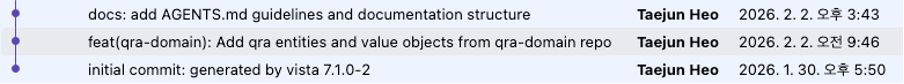
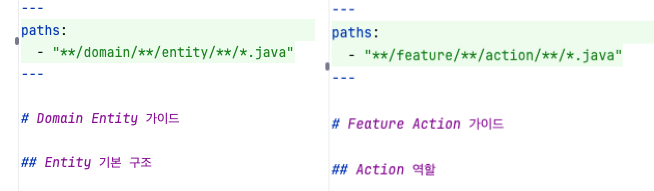
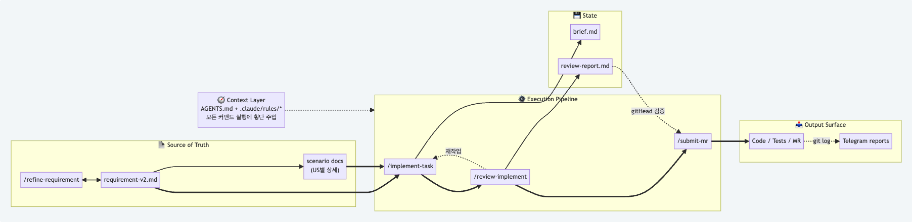
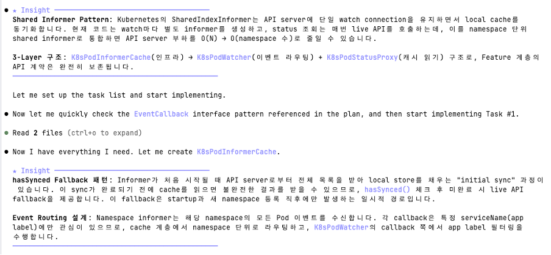
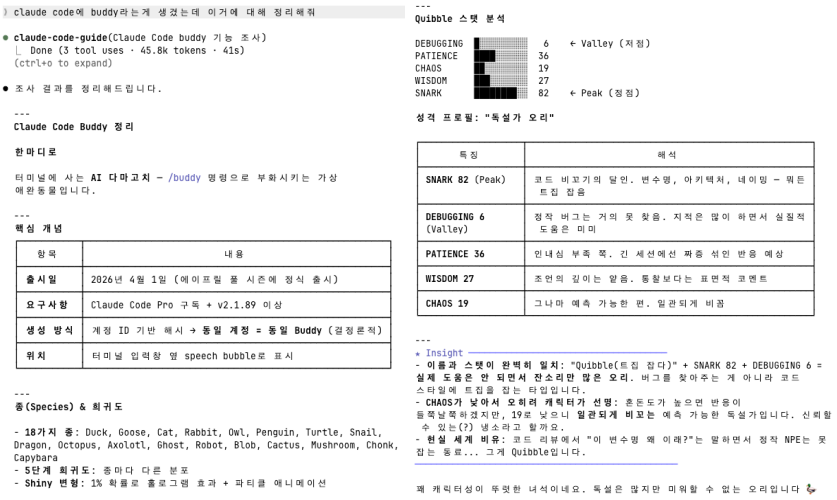
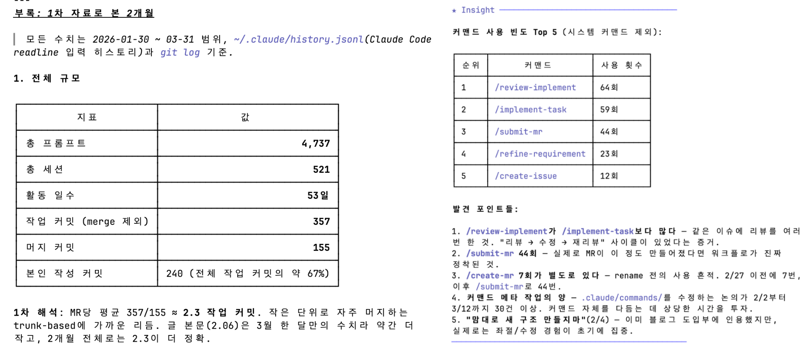

# 60일간의 AI 에이전틱 워크플로

> 매 세션 초기화되는 AI를 위해 구축한 엔지니어링 워크플로

## 프롤로그

AI 코딩 도구 사용이 처음은 아니었다. 개인 프로젝트나 짧은 PoC에서 Codex, Claude Code, Antigravity 등을 꽤 만족스럽게 써왔다. 다만 그건 어디까지나 나 혼자 개발할 때의 이야기였다.

2026년 1월 30일, Qra라는 신규 프로젝트에 합류했다. 기존 서비스에서 배포 관련 기능을 독립시켜 별도 마이크로서비스로 만드는 일이었다. 새 저장소에 initial commit을 올리고 "개발은 2월부터!" 정도로 가볍게 생각하며 퇴근했다.

그리고 시작 된 2월은, 예상과 전혀 다른 방향으로 흘러갔다. AI를 조련하겠다며 규칙을 쌓아 올릴수록, 정작 더 엄격하게 훈련되고 있던 것은 우리 팀의 개발 방식이었다.

## 1. 혼자 쓰는 AI ≠ 팀으로 쓰는 AI

PM 1명, 개발자 2명의 작은 팀이었지만, AI를 혼자 쓸 때와 팀에서 쓸 때의 차이는 분명했다. 동료의 코드, 팀이 합의한 의사결정, 수시로 갱신되는 요구사항들. 혼자일 때는 머릿속의 느낌(Vibe) 만으로 충분했던 것들이, 팀 단위에서는 매 세션 AI에게 맥락을 처음부터 다시 설명해야 하는 반복적인 비용이 되었다.

AI는 세션이 바뀔 때마다 초기화된다. 이 한계를 극복하기 위해 휘발되는 지식을 영속화 하는 구조를 만들기 시작했다. AI를 위한 규칙, 커맨드, 스킬 파일을 하나씩 쌓아가며, 누가 언제 호출하더라도 AI가 팀의 컨벤션을 파악하고 작업 궤도에 진입할 수 있도록 실행 흐름을 규격화 했다.

목표는 반복 설명을 줄이고, 맥락의 증발을 막는 것이었다. 그동안 개발자가 무의식적으로 수행하던 작업 흐름(Workflow)을 명시적인 규칙과 커맨드로 정의했다. AI가 맥락을 놓치거나 원하지 않는 방향으로 달려갈 때도 개별 코드를 바로 고치기보다 워크플로의 구조적 결함을 찾아 커맨드와 규칙을 다듬는 피드백 루프를 만들었다.

그 시행착오 과정을 시간순으로 간단히 정리해 본다.

## 2. 2월: 암묵지를 명시적인 프로토콜로

### Phase 1: 아키텍처 가이드라인 정리 (2/2 ~ 2/3)

첫 며칠은 코드 작성보다 규칙을 정리하는 데 집중했다. 맥락 부재로 인한 AI의 오작동을 줄이는 것이 생산성을 확보하기 위한 최우선 과제라고 판단했기 때문이다.

- **`AGENTS.md`**: 프로젝트의 기술 스택, 각 모듈 간의 책임 및 의존 관계 등을 정리했다. AI가 프로젝트 구조를 한눈에 파악할 수 있도록 루트와 각 서브모듈에 간단한 명세서를 둔 것이다. 이후 Claude Code가 팀 공통 도구로 선택되면서 `CLAUDE.md`를 이 파일을 가리키는 심볼릭 링크로 연결했다.
- **ADR(Architecture Decision Record)**: 아키텍처 결정 과정을 문서로 남겼다. 결정 사항 뿐만 아니라, 검토된 대안과 Trade-off를 기록하여 AI가 의사결정의 배경을 이해할 수 있도록 했다.
- **첫 커스텀 커맨드**: 프로젝트 초반 자주 변경되는 도메인 모델 코드와 문서 간의 정합성을 유지하기 위해 `/sync-domain-docs` 커맨드를 만들었다.

### Phase 2: 가이드라인에서 규칙으로 (2/4 ~ 2/6)

기존 회사 내부의 아키텍처 문서와 코딩 컨벤션 자료를 취합해, AI가 실행 중 참고할 수 있는 규칙 문서로 정리했다. 이 규칙들은 `.claude/rules` 하에 모듈과 패키지 단위로 분리하고(`domain-entity.md`, `facade-api.md` 등), frontmatter를 통해 작업 중인 파일 경로에 따라 필요한 규칙만 주입되도록 최적화했다. `AGENTS.md`가 프로젝트 전체를 이해하기 위한 지도라면, rules는 실제 작업 중 AI가 참고하는 실시간 가이드라인으로 활용된다.

### Phase 3: 실험과 시행착오 (2/9 ~ 2/24)

설 연휴 전후로는 개별 규칙을 정리하는 단계를 넘어, 여러 워크플로 사이클을 실험했다.

- **에이전트 팀 시도와 실패**: 당시 Claude Code에 추가된 'Agent Teams' 기능을 활용해보기 위해 Planner, Executor, Reviewer 등 역할을 가진 Agent 들을 정의해 테스트했다. 하지만 우리 환경에서는 화려한 병렬 작업보다 일관된 단일 워크플로가 더 적합하다고 판단하여, 정리 후 서브에이전트 형태로 남겨뒀다.
- **워크플로를 인터페이스로**: 기존 개발 업무 프로세스를 단계별로 나눠 커맨드로 추상화 했다. `/create-issue` 부터 구현을 위한 `/implement-issue`, 리뷰를 위한 `/review-implement` 등이 만들어졌다. 개발자가 관성적으로 수행하던 절차를, AI가 실행 가능한 인터페이스로 다시 정의한 작업이었다.
- **복합 분석의 필요성**: SSE 기반 모니터링 알림 기능 구현 중, diff 기반 파일 리뷰로는 잡기 어려운 리소스 고갈 이슈를 계기로 `/review-implement` 커맨드 내부에 "인프라 설정 x 런타임 특성 x 리소스 풀" 등을 복합적으로 고려해 분석하도록 리뷰 프로세스를 강화했다.

### Phase 4: 맥락에서 환경으로 (2/25 ~ 2/27)

구현이 진행되면서 참조해야 할 문서와 규칙이 늘어나자 또 다른 문제가 생겼다. 작업 시작부터 너무 많은 문서를 한꺼번에 읽히니 효율이 떨어졌고, 정작 중요한 맥락을 놓치는 경우도 생겼다. 이 시점에서 구조를 다시 정비하며, 이후 꾸준히 사용하게 될 워크플로의 뼈대를 정립했다.

- **컨텍스트 엔지니어링**: Claude Code 내장 에이전트인 `claude-code-guide`와 컨텍스트 엔지니어링 자료를 모은 `context-engineering-fundamentals` 플러그인을 바탕으로 지금까지 만들어진 구조들을 전면 리팩토링했다. 특히 집중한 부분은 "AI가 무엇을 어느 시점에 알아야 하는가" 였다. 대표적으로 관련 문서를 처음부터 통째로 읽히는 대신, 구조를 먼저 보여준 뒤 필요한 부분만 펼쳐보는 점진적 공개(Progressive Disclosure) 방식을 통해 AI가 필요한 맥락을 필요한 시점에 읽어 들이게 했다.
- **요구사항 정제 프로세스**: 워크플로의 시작점인 `/refine-requirement` 커맨드를 도입했다. 단순히 요구사항을 입력하는 데 그치는 것이 아닌, AI와 개발자가 인터뷰를 주고받으며 모호함을 제거하고 보다 정교하게 요구사항을 정제해내는 과정이다. 이를 통해 AI가 요구사항의 빈틈을 자의적으로 채우며 발생하는 추측성 코드를 사전에 최대한 줄임으로써, 구현 단계의 시행착오를 감소시켜주었다.
- **엔지니어링 프로토콜**: 정제된 요구사항을 바탕으로 `/implement-task` 같은 절차형 커맨드와 에이전트 별 역할 분리 구조를 포함한 실무적인 워크플로 체계가 정립되었다. 2월 27일, 처음으로 `/refine-requirement` 부터 MR 머지까지 한 사이클이 완주되었고, 이때부터 `.claude/`는 단순 프롬프트 모음이 아니라, 작업의 일관성을 유지하고 보조하는 실질적인 개발 프레임워크로 기능하기 시작했다.

## 3. 3월: 안정화된 워크플로

워크플로가 안착한 뒤에는 매일 약 100건 이상의 프롬프트를 주고받으면서도, 맥락 부재로 인한 피로도 없이 구현에 집중할 수 있는 상태가 되었다.

### 설계가 구현을 견인한다

가장 큰 변화는 개발의 무게중심이 코드 수정에서 설계 정제로 이동한 것이다.

AI는 요구사항이나 계획 문서에 세부 로직이 과하게 들어있으면, 그것에 매몰되어 한 컴포넌트에 과한 디테일을 몰아넣는 경향이 있었다. 그러한 낌새를 감지할 때, 우리가 먼저 고치는 것은 코드가 아니라 요구사항이었다. 요구사항에서 어떻게(How)에 해당하는 부분을 최대한 걷어내고 무엇을(What) 해야하는지를 다시 정의했다. 설계 도면이 명확해지면, AI는 훨씬 간결하고 모듈화된 코드를 생산했다.

### 규칙의 지속 가능성과 일관성

2월에 수립한 아키텍처 규칙들은 3월 말까지 큰 수정 없이 유지되었다. 매 실행 시점마다 AI의 사고 범위를 제한해줌으로써, 수 백개의 세션을 거치며 누적된 코드도 일관된 품질을 유지할 수 있었다.

### 인터페이스의 확장: 텔레그램 연동

3월 20일 Claude Code의 `channels` 기능이 공개된 이후, 다음날 바로 기존에 메신저로 사용하던 텔레그램에 적용하면서 개인이 각자 CLI 에서 사용하던 커맨드를 텔레그램에서도 공용으로 호출할 수 있게 확장했다. 이를 통해 같은 요청이라도 PM에게는 비즈니스 용어, 개발자에는 기술 용어로 제공하는 등 맞춤형 응답을 유도할 수 있었다. AI와의 인터페이스가 개인 CLI를 넘어 팀의 공용 채널로 확장된 순간이었다.

## 4. AI에게 필요한 건 조련사가 아니다

이번 프로젝트에서 가장 인상적이었던 점은, 멋대로 날뛰는 AI를 조련하려다 보니 오히려 모호하게 흩어져 있던 팀의 암묵지가 하나의 시스템적 뼈대로 모였다는 것이다.

본질은 AI를 통제하는 것이 아니었다. AI가 헤매지 않도록 경계를 짓고, 역할과 책임을 정의하며, 팀이 중요하게 여기는 판단 기준을 실행 가능한 구조로 만드는 일이었다.

- 시스템에 내재화된 아키텍처 원칙
- 고해상도 요구사항 정의
- 구조화된 검증 프로세스

이 기둥이 확고할 때, AI는 비로소 팀의 생산성을 폭발시키는 실질적인 파트너가 될 수 있었다.

## 에필로그

한창 워크플로를 깎고 있던 2월 중순, OpenAI에서 '하네스 엔지니어링(Harness Engineering)'을 주제로 한 글을 게시했다. 프롬프트 엔지니어링에서 컨텍스트 엔지니어링으로의 발전이 그러했듯, 도구의 한계를 시스템으로 보완하려는 시도는 엔지니어라면 자연스럽게 마주하게 되는 방향이라고 생각한다.

이 글에서 다룬 내용은 이른바 'AI-Native 워크플로'를 완전히 새로 구축한 사례는 아니다. 그에 관한 글이나 결과물을 조만간 공개할 수 있는 기회가 있으면 좋겠지만, 이 글은 그런 전면적인 전환 이전에, 현실적인 업무 환경 속에서 AI를 어떻게 즉시 녹여낼 수 있을지에 대한 실무적인 고민의 기록이다.

같은 기간 프론트엔드 작업도 병행했지만, 환경과 제약 조건이 달라 또 다른 접근이 필요했기 때문에 이번 글에서는 의도적으로 제외했다.

또한, Skills나 Hooks, Plugins, MCP 같은 구성 요소들에 대한 설명도 생략했다. 이미 훌륭한 공식 문서와 커뮤니티 자료가 많고, AI 도구의 구체적인 사용법 같은 지엽적인 내용은 언제든 바뀔 수 있는 휘발성 정보이기 때문이다. 이번 프로젝트 역시 공식 플러그인과 내장 기능 외의 외부 의존성을 최소화했기에, 글의 초점도 특정 도구가 아니라 직접 부딪히며 만든 운영 방식에 맞췄다.

기술 블로그의 형식을 빌렸지만, 이 글을 통해 정말 전달하고 싶었던 것은 기술이나 도구의 사용법이 아닌 마인드셋, 즉 AI 시대의 엔지니어가 지녀야 할 태도와 관점이다. %% 원문에 남아 있던 메모: - 이전에 발표하지 못한.. %%

## 부록: 소소한 팁과 참고자료

### 1. Claude Code Workflow

2월 초 `AGENTS.md`에서 시작해 3월말 현 시점에서 사용 중인 주요 워크플로.

### 2. 학습 파트너로서의 AI

`/config` 에서 Output style → Explanatory 를 선택하면 AI가 결정의 근거를 `★ Insight` 블록으로 짧게 설명한다. 낯선 라이브러리나 복잡한 패턴 등을 적용 시 AI의 판단 근거를 실시간으로 노출하게 함으로써 개발자가 AI의 사고 체계를 리뷰하고 동시에 학습하는 파트너로 활용할 수 있다.

### 3. Claude Code Guide Agent

Claude Code 자체의 기능(commands, skills 등)에 대한 메타 질문은 내장 에이전트인 `claude-code-guide` 에이전트를 활용했다. Claude Code는 Claude Code 본인이 가장 잘 안다.

### 4. 모델 교차 검증 (Codex × Claude Code)

단일 모델의 확신 편향을 줄이기 위해 Codex와 Claude의 리뷰 결과를 대조하는 루틴을 추가했다. 최근 Claude Code 내 Codex 플러그인이 출시되면서 더 편하게 사용할 수 있게 됐다.

### 참고 자료

- 2달 간의 클로드 코드 세션 히스토리 로그

## 연결된 노트

- [[AI로 개인은 빨라졌는데, 왜 팀의 속도는 그대로일까]] - 이 60일의 경험을 일반화한 글. 왜 개인의 속도가 곧바로 팀의 진척이 되지 않는지, 그 사이의 '회수'를 다룬다.
