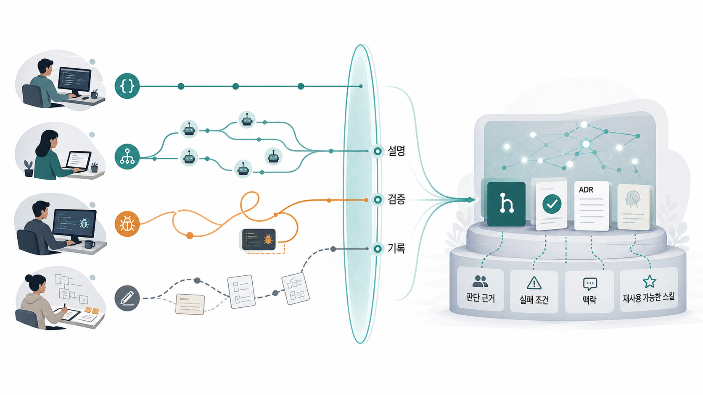
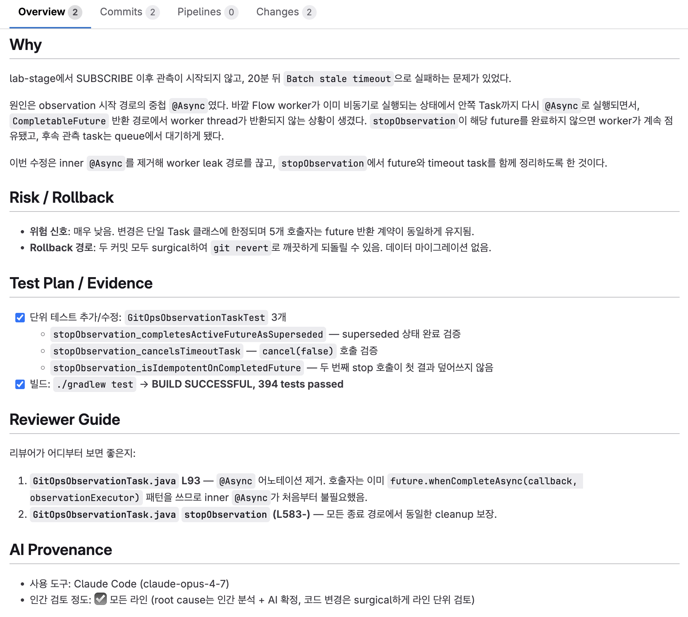

AI로 코드는 더 빨리 나오는데, 왜 팀의 속도는 그만큼 빨라지지 않을까요?

처음에는 개인의 사용법 문제라고 생각했습니다. 자주 쓰는 커맨드와 규칙을 모으고, 반복되는 작업을 파이프라인으로 묶어 팀에 공유했습니다. 그러면 개인의 속도가 자연스럽게 팀의 속도로 이어질 거라고 기대했습니다.

하지만 팀에서 막히는 지점은 달랐습니다. 코드 초안이 나오는 속도는 분명히 빨라졌지만, 그 초안이 리뷰를 통과해 동료가 이어받을 수 있는 변경이 되기까지 걸리는 시간은 크게 줄지 않았습니다.

팀의 속도를 좌우한 것은 결과물을 만드는 일이 아니라, 그 결과물을 팀이 책임질 수 있는 변경으로 바꾸는 일이었습니다. 저는 이 능력을 **흡수**라고 부르겠습니다. 흡수란 변경을 팀이 판단하고, 이유를 따라가고, 잘못됐을 때 되돌릴 수 있는 상태로 받아들이는 일입니다.

> 그 시행착오의 과정을 담은 지난 글: [[60일간의 AI 에이전틱 워크플로]]
> ![[thumbnail-ai-harness-loop.jpg]]

## 병목은 작성에서 흡수로 이동했다

이 문제는 AI가 새로 만든 문제라기보다, 이미 있던 병목을 더 빨리 드러낸 문제에 가깝습니다. AI 이전에도 맥락이 부족한 PR, 형식적인 리뷰, 공유되지 않은 판단은 있었습니다. 다만 그때는 결과물을 만드는 데 시간이 걸렸습니다. 코드를 쓰고 문서를 다듬는 과정의 마찰이 느리긴 했지만, 그만큼 판단을 정리할 틈도 만들어줬습니다.

AI는 이 마찰을 크게 줄였습니다. 더 많은 결과물이 더 빠르게 팀 안으로 들어옵니다. 낯선 영역에서도 완성도 있어 보이는 설계안과 코드 초안을 금세 만들 수 있습니다.

하지만 AI가 낮춘 것은 **첫 결과물을 만드는 문턱**입니다. 차이는 그다음에 생깁니다. 누가 그 결과물을 시스템 맥락 안에서 검증했는가. 어떤 전제를 확인했는가. 어떤 위험을 받아들였고, 어떤 위험은 배제했는가. 다음 사람이 이어받을 수 있도록 무엇을 남겼는가.

이 흐름은 우리 팀만의 감각은 아니었습니다. 한국은행의 2026년 이슈노트도 비슷한 단절을 짚습니다. 생성형 AI는 업무시간을 평균 3.8% 줄였지만, 줄어든 시간이 곧바로 실제 생산 증가로 이어지지는 않았습니다.

이유는 개발팀에서도 익숙합니다. 개인 작업은 빨라졌지만, 그 결과를 검토하고 승인하고 운영에 넣는 흐름이 그대로라면 절약된 시간은 산출이 아니라 대기시간으로 남습니다. 결국 병목은 **작성**에서 **흡수**로 이동합니다.

## AI 산출물은 아직 팀의 지식이 아니다

AI가 만든 코드는 저장소에 들어옵니다. AI가 쓴 문서는 위키에 올라오고, AI가 정리한 분석은 회의 안건이 됩니다. 겉으로는 모두 내부 산출물처럼 보입니다.

하지만 생성 과정에서 오간 판단 근거, 버려진 대안, 생략된 제약 조건은 팀 안에 남지 않는 경우가 많습니다. 결과물은 내부에 있지만, 그것을 이해하는 데 필요한 맥락은 개인의 세션이나 대화 로그에 머물러 있습니다.

이 간극을 메우는 능력, 그러니까 앞에서 흡수라고 부른 그 능력을 조직 이론에서는 **흡수 역량(Absorptive Capacity)**이라고 부릅니다. 외부 지식의 가치를 알아보고, 이해해서 기존 지식과 연결한 뒤, 내 것으로 만드는 능력. 리뷰 부담이나 온보딩 비용 같은 익숙한 말로는 다 담기지 않는, 받아들이는 쪽의 능력 이야기라서 이 단어를 골랐습니다.

AI 산출물도 마찬가지입니다. 저장소에 들어온 뒤에도 팀의 맥락과 연결되고 검증 가능한 형태가 되기 전까지는 아직 팀의 지식이 아닙니다.

흡수가 막힌 팀에서 가장 먼저 눈에 띄는 증상이 **워크슬롭(Workslop)**입니다. 작년부터 많이 돌던 말이라 들어보셨을 겁니다. 형식은 멀쩡한데 일을 진전시키지 못하고, 받는 사람에게 해석과 검증 숙제를 떠넘기는 산출물에 HBR에 실린 연구가 붙인 이름이죠.

개발팀에서는 맥락 없는 AI 생성 코드, 근거가 얇은 PR, 판단 과정이 빠진 아키텍처 결정 등으로 나타납니다. 겉이 멀쩡할수록 늦게 드러나죠.

워크슬롭의 문제는 단순히 시간이 더 든다는 데 있지 않습니다. 원래 작성자가 고민하고 정리했어야 할 인지적 부담을 리뷰어에게 넘긴다는 데 있습니다. 리뷰어는 코드의 결함을 보기 전에 작성자의 의도, 버린 대안, 확인한 전제부터 복원해야 하죠. 이런 일이 반복되면 리뷰는 협업의 안전장치가 아니라, 작성자가 남기지 않은 맥락을 대신 복원하는 비용이 됩니다. 다음 PR을 볼 때도 “이것도 처음부터 해독해야 하나”라는 경계심이 먼저 생기고, 팀 안의 신뢰도 조금씩 깎입니다.

하지만 이것을 개인의 성실성 문제로만 치부해서는 안 됩니다. 워크슬롭은 개인의 태도나 AI 자체의 결함이라기보다, AI 산출물을 흡수할 구조가 팀에 없을 때 나타나는 증상에 가깝습니다.

## 받아들일 수 있는 변경에는 조건이 있다

소프트웨어 엔지니어링으로 옮기면 이렇게 됩니다. 팀의 경계를 넘어오는 변경에, 세 가지를 물을 수 있어야 합니다.

- 팀이 판단 가능한 형태인가?
- 시간이 지나도 이유를 따라갈 수 있는가?
- 잘못됐을 때 되돌릴 수 있는가?

이 질문은 코드에만 해당하지 않습니다. 설계 문서, 기술 결정, 운영 변경처럼 팀이 이어받아야 하는 산출물에도 같은 기준이 적용됩니다.

### 판단 가능성

첫째는 판단 가능성(Reviewability)입니다. 리뷰어가 변경을 보고 받아들일지 말지 가릴 수 있느냐는 건데, 가독성 이야기만은 아닙니다. 산출물이 하나의 논리 단위로 정리되어 있고, 어떤 문제를 해결하려 했는지, 영향 범위는 어디까지인지, 어떤 기준으로 봐야 하는지가 드러나야 합니다.

팀의 기존 기준으로 평가할 수 있는지도 포함합니다. 코드가 동작하더라도 팀이 합의한 아키텍처, 네이밍, 예외 처리, 테스트 방식을 벗어났다면 팀의 코드로 흡수될 자격을 갖춘 것이 아닙니다.

### 추적 가능성

추적 가능성(Traceability)은 시간이 지난 뒤의 이야기입니다. AI를 쓰면 결과물은 금세 나오지만, 거기까지의 중간 판단은 기록해두지 않으면 세션이 닫히는 순간 함께 사라집니다. 왜 이 방법을 골랐고 어떤 대안을 버렸는지, 그 흔적을 팀이 따라갈 수 있어야 같은 문제 앞에서 판단을 반복하지 않고, 필요하면 기존 결정을 고칠 수 있습니다.

### 복구 가능성

마지막 복구 가능성(Recoverability)은 결이 조금 다릅니다. 이해의 문제가 아니라, 틀렸을 때 빠르게 알아채고 되돌릴 수 있느냐는 질문이죠. AI가 만든 결과물은 처음 리뷰를 자연스럽게 통과해도 위험이 운영에서 늦게 드러날 수 있습니다. 그래서 목표는 실수를 완전히 막는 게 아니라, 들어온 실수를 팀이 감당할 수 있는 범위에서 발견하고 복구하는 것입니다.

## 방법은 달라도, 책임 경계는 같아야 한다

이 기준을 개인의 AI 사용법까지 일일이 맞추자는 뜻으로 받아들이면 곤란합니다.

사람마다 문제를 푸는 방식이 다르고, 맡은 영역도 다릅니다. 어떤 도구를 쓰고, 프롬프트를 어떻게 조합하고, 어떤 경로로 문제를 해결할지는 개인마다 달라도 됩니다.

맞춰야 할 지점은 결과물이 팀의 저장소로 넘어오는 경계입니다.

그렇다면 흡수도 AI에 맡기면 되지 않을까요. AI는 이미 작업 로그와 diff, 테스트 결과에서 리뷰 재료를 모아줍니다. 반복 패턴, 스타일 위반, 누락된 테스트 후보처럼 기계적으로 점검하기 좋은 영역에서는 사람보다 더 꼼꼼할 때도 있습니다. 그래도 흡수의 끝은 검증이 아니라 책임입니다. 변경이 잘못되면 결과를 감당하는 쪽은 결국 팀이지, 도구가 아니니까요. 그래서 "이 변경을 받아들여도 되는가"라는 마지막 판단만큼은 사람이 쥐고 있어야 합니다.



## PR 경계에서 확인할 기준

대부분의 개발팀에서 이 책임 경계가 드러나는 가장 현실적인 자리는 PR입니다.

앞의 조건은 PR에서 다음 원칙으로 옮겨볼 수 있습니다.

- **판단 가능한 단위로 정리하고 설명합니다.** 무조건 잘게 쪼개라는 뜻이 아니라, 크든 작든 하나의 논리 단위로 묶여 있어야 한다는 뜻입니다. AI가 리뷰 포인트를 먼저 뽑아줄 수는 있지만, 이 변경이 어떤 문제를 풀고 어디까지 영향을 주는지는 작성자가 자기 문장으로 확정해야 합니다.

- **판단 근거와 사람이 확인한 범위를 나눠 남깁니다.** AI가 정리한 내용과 사람이 직접 확인한 내용을 구분해야 합니다. 어떤 전제를 확인했는지, 어떤 대안을 버렸는지, 어떤 로그와 실행 결과를 믿어도 되는지가 PR 안에서 이어져야 합니다.

- **깨졌을 때 확인 지점과 되돌리는 방법을 남깁니다.** 리뷰어는 작성자의 판단을 다시 검토하는 사람이지, 비어 있는 맥락을 처음부터 채우는 사람이 아닙니다. 작성자는 최소한의 판단 근거뿐 아니라, 문제가 생겼을 때 어디서부터 확인하고 되돌릴 수 있는지도 함께 넘겨야 합니다.

이 원칙을 매번 긴 문서로 만들 필요는 없습니다. 네 줄짜리 질문으로 줄이면 이렇게 됩니다.

```markdown
- 왜 이 방식인가:
- 직접 검증한 범위:
- 리뷰어가 봐야 할 관점:
- 깨졌을 때 첫 확인 지점과 되돌리는 방법:
```

예를 들어 우리 팀이 운영하는 Gallery 서비스의 `stopObservation` worker thread leak 수정 MR에서는 리뷰어가 바로 확인해야 할 지점을 네 가지로 나눠 남겼습니다.



맨 아래 AI Provenance 칸에는 어떤 도구를 썼고 사람이 어디까지 검토했는지도 남겼습니다. 이렇게 세션 로그와 diff에서 초안을 모으는 일은 AI에게 맡길 수 있습니다. 다만 실제로 확인한 범위, 리뷰어가 봐야 할 관점, 깨졌을 때 되돌리는 방법은 작성자가 확정해야 합니다.

물론 이 네 줄도 의무 칸이 되는 순간 "기존 패턴 따름" 같은 형식적인 답으로 굳을 수 있습니다. 협업 절차를 세세하게 강제하자 오히려 산출물 품질이 떨어졌다는 Microsoft의 현장 실험이 보여준 함정입니다. 그런 답이 올라오면 리뷰어가 그 자리에서 되물을 수 있어야 템플릿이 의례로 변하지 않습니다. 네 줄의 가치는 형식이 아니라 책임의 귀속에 있습니다. AI가 초안을 만들 수는 있어도, "내가 확인했다"는 한 문장만큼은 사람의 몫으로 남습니다. 확인할 수 없는 영역이라면 그 사실을 적는 것까지가 정직한 사용법입니다. "이 부분은 제 전문 밖이라 도메인 리뷰어의 확인이 필요합니다"도 책임 있는 한 줄입니다.

마지막 질문은 하나입니다. 이 변경이 팀이 책임질 수 있는 상태로 들어오는가.

## AI는 엔지니어링 시스템을 증폭한다

앞에서 말한 판단 가능성, 추적 가능성, 복구 가능성은 PR 문장만으로 생기지 않습니다. lint, formatter, 아키텍처 테스트, ADR, feature flag, 단계적 배포, 롤백 가능한 마이그레이션, 모니터링 같은 장치가 함께 있어야 합니다.

모두 AI 이전부터 있던 장치들입니다. AI가 바꾼 것은 이 장치들의 필요성이 아니라, 그 필요성이 드러나는 속도입니다. 변경을 작게 나누고, 판단 근거를 남기고, 문제가 생겼을 때 되돌릴 수 있는 팀은 AI로 더 많은 변경을 안전하게 흡수합니다. 다만 여기에는 값이 있습니다. 검증하고 판단하는 시간은 결국 리뷰어의 시간에서 나옵니다. 리뷰 우선순위든 생성량 조절이든 그 시간을 어디서 확보할지 함께 정하지 않으면, 장치만으로는 오래 버티지 못합니다.

반대로 이 장치들이 약한 팀에서는 맥락 없는 PR과 검증되지 않은 변경이 더 빠르게 쌓입니다. DORA의 2026년 보고서가 내린 결론도 같습니다. AI는 증폭기라서, 팀이 가진 강점도 약점도 그대로 키웁니다.

물론 모든 팀의 병목이 흡수는 아닙니다. 배포 주기나 의사결정 지연이 먼저인 조직도 있습니다. 다만 작성 속도가 풀렸는데도 팀이 그대로라면, AI가 생산성을 올리지 못해서가 아니라 그 생산성을 받아낼 구조가 없는 건 아닌지부터 의심해 볼 일입니다.

## 팀의 속도는 흡수에서 나온다

처음의 질문으로 돌아갑니다. 저는 개인의 사용법 문제라고 생각했고, 커맨드와 파이프라인을 공유하면 풀릴 줄 알았습니다. 지금 보면 막혀 있던 것은 사용법이 아니라 흡수였습니다.

개인의 AI 활용은 팀 생산성의 출발점일 뿐입니다. 팀의 속도는 산출물의 양에서 나오지 않습니다. 그 산출물을 판단 가능하고 추적 가능하고 복구 가능한 변경으로 받아들이는 능력에서 나옵니다.

그래서 조직이 물어야 할 질문은 "AI를 얼마나 많이 쓰는가"가 아닙니다.

**AI 산출물을 팀이 책임질 수 있는 지식으로 바꾸고 있는가?**

이 질문에 답하지 못하면 개인의 속도는 팀의 진척으로 이어지지 않습니다. 다음 사람이 갚아야 할 비용으로 남을 뿐입니다.

---

## 참고 문헌

본문의 주요 주장과 직접 연결되는 자료만 추렸습니다.

- Cohen & Levinthal, ["Absorptive Capacity: A New Perspective on Learning and Innovation"](https://doi.org/10.2307/2393553) (Administrative Science Quarterly, 1990) — 외부 지식을 조직 안에서 식별, 소화, 활용하는 능력
- 서동현·오삼일·윤종원, 「AI 도입은 생산성을 높이는가? 초기 3년의 효과 분석」, BOK 이슈노트 제2026-12호, 한국은행, 2026-06-08 — AI가 업무시간을 줄였지만 실제 생산 증가로 이어지지 않은 '생산성 단절' 분석
- Niederhoffer, Kellerman et al. (BetterUp Labs & Stanford Social Media Lab), ["AI-Generated 'Workslop' Is Destroying Productivity"](https://hbr.org/2025/09/ai-generated-workslop-is-destroying-productivity) (Harvard Business Review, 2025-09) — 형식만 채운 AI 산출물이 수신자의 재작업 비용과 신뢰 비용을 만든다는 조사
- Farach, Cambon et al. (Microsoft), ["Scaffolding Human-AI Collaboration"](https://arxiv.org/abs/2604.08678) (arXiv, 2026-04) — Fortune 500 리테일러의 문서 작업 실험에서 구조화된 AI 협업 프로토콜의 한계를 관찰한 연구
- DORA, 「ROI of AI-Assisted Software Development」 (2026-05) — AI는 증폭기로서 팀이 가진 엔지니어링 시스템의 강점과 약점을 그대로 확대한다는 분석

## 연결된 노트

- [[60일간의 AI 에이전틱 워크플로]] - AI를 팀 개발 흐름에 넣으며 책임 경계를 다듬은 실전 경험입니다.
- [[AI 시대 플랫폼팀은 어떻게 진화하는가]] - AI 시대에 플랫폼팀이 조직의 학습과 전환을 설계해야 한다는 배경 관점입니다.
- [[개인의 AI 활용을 팀의 역량으로 바꾸려면]] - 이 글의 출발점이 된 원문입니다.


> AI는 증폭기입니다. 강점만 증폭하지 않습니다. 약점도 함께 증폭합니다. 변경을 작게 나누는 습관이 있는 팀은 AI로 더 많은 실험을 더 안전하게 흡수합니다. 테스트와 배포 경계가 잘 잡힌 팀은 AI가 만든 결과물을 빠르게 검증하고 운영으로 가져갑니다. 결정 기록과 리뷰 기준이 남아 있는 팀은 생성 속도의 증가를 팀의 학습 속도로 바꿉니다.
