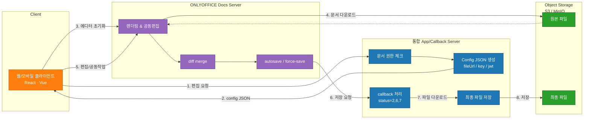

# ONLYOFFICE 연동기 1편 - 그냥 문서 편집기인 줄 알았는데

## 들어가며

ONLYOFFICE는 오픈소스 기반 문서 편집 솔루션이다.
한국에서는 Wesome이 공식 Gold Partner로 기술지원·컨설팅·구매대행을 제공하고 있다.

> - OnlyOffice 공식 사이트: https://www.onlyoffice.com
> - Wesome의 OnlyOffice 소개: https://www.wesome.co.kr/onlyoffice/

WeSome 페이지 하단에 있는 _주요 실적_ 중 한 곳에 기여했는데, 나와있듯이 2024년부터 국내 기업들이 도입하는 추세라 개발 당시 레퍼런스를 찾기가 쉽지 않았다. 
애초에 onlyoffice는 대부분 보안이 중요한 환경에서 도입하는 솔루션이라 구체적인 구축 사례가 외부에 잘 공개되지 않는다. 물론 필자도 자세한 건 밝힐 수 없다.

개발 당시 onlyoffice 포럼을 뒤지고 메일로 직접 문의도 해보고, LLM은 당연히 못 쓰는 환경이고 onlyoffice에 대해 llm에 물어봐도 학습을 많이 못했는지 큰 도움은 안되었다.

여튼 여러 우여곡절이 있긴 했는데 이번 시리즈는 철저히 onlyoffice docs 구축 부분만 작성한다. 실제 코드를 가져다 쓸 수도 없으니 의사 코드나 다이어그램 위주로 진행 될 듯 하다.

---

## OnlyOffice란?

> - OnlyOffice Basic Concepts: https://api.onlyoffice.com/docs/docs-api/get-started/basic-concepts/

OnlyOffice Docs는 쉽게 말하면 **설치형 웹 오피스 스위트**다. 브라우저에서 Word/Excel/PPT를 편집하고 실시간 공동 작업도 지원한다.
여기까지 보면 Google Docs, Office 365 같은 SaaS 기반 문서편집 도구가 떠오를 것이다. 하지만 **보안 규제가 강한 기업 환경(금융, 제조, 공공 분야 등)**에서는 클라우드 기반 SaaS를 도입하기 어려운 경우가 많다.

- 문서를 외부 클라우드에 업로드할 수 없음
- 고객사·협력사와 주고받는 설계 문서에 민감한 정보가 많음
- 내부망(망분리)에서 운영해야 함
- 파일 접근·권한 정책을 사내 시스템과 완전히 통합해야 함
- 로그, 보안 정책, 감사(Audit) 항목을 사내 기준으로 커스터마이징해야 함

이런 조건을 만족하면서 브라우저 기반 공동 편집까지 지원해야 한다면
사실상 OnlyOffice 같은 온프레미스 솔루션이 거의 유일한 선택지다.

- 문서가 외부로 나가지 않음
- 사내 스토리지(S3·NAS·사내 Object Storage)에만 저장
- JWT 기반 인증으로 기존 시스템과 권한 통합 가능
- 100% 온프레미스 운영 가능
- 내부망에서도 정상 동작
- 브라우저에서 Word/Excel/PPT 공동편집 가능

특히 한국 기업이 많이 요구하는 **HWP/HWPX(한글 문서)**도 지원한다는 점도 크다.

그래서 “문서 편집기 하나 붙이는 작업”처럼 보이지만, 실제로는
기업 내부의 보안 정책과 협업 요구를 모두 만족시키는 문서 플랫폼을 구축하는 일에 가깝다.

---

## 🧩 OnlyOffice 내부는 어떻게 구성되어 있을까?

OnlyOffice를 실제로 붙여보면 금방 깨닫는데, 이것도 결국 하나의 **문서 플랫폼**이다.
에디터 하나처럼 보이지만 내부에는 여러 역할이 분리된 서비스들이 존재한다.
공식 문서를 보면 다음과 같은 컴포넌트로 구성돼 있다.

### **클라이언트 측**

#### **1) Document Manager (문서 관리 UI — 서비스 개발자가 직접 구현)**

* 사용자가 보는 문서 목록 UI
* 문서를 선택하고 “열기/보기/편집”을 하는 화면
* OnlyOffice Docs에는 포함되지 않음
* UI까지 제공하는 Workspace 제품을 쓰지 않는 이상 **개발자가 직접 구현해야 한다**

#### **2) Document Editor (문서 편집 UI — ONLYOFFICE Docs 제공)**

* iframe으로 embed되는 편집기
* Word/Excel/PPT/PDF 편집 기능 포함
* 실시간 공동 편집이 이루어지는 브라우저 인터페이스
* 내부에서 Document Editing Service와 통신 (WebSocket)

### 서버 측 구성요소

ONLYOFFICE Docs Server에는 아래 5개 서비스가 포함된다
(= 우리가 설치하는 `documentserver` 컨테이너 안에 들어있음)

#### **1) Document Editing Service (문서 편집/렌더링 핵심 엔진)**

* 문서를 보는 것부터 공동 편집까지 모든 동작을 수행
* diff/merge, change tracking, 실시간 sync 처리
* Editor UI와 WebSocket으로 통신
* 서버에서 문서를 렌더링하고 브라우저로 전달

➡️ **가장 중요한 핵심 엔진. 흔히 “Docs Server”라고 부르는 부분.**

#### **2) Document Command Service (에디터에 명령 전달 API)**

* 서버가 에디터에 특정 작업을 강제로 시킬 때 사용

  * 강제 저장(force save)
  * 새 버전 만들기
  * 문서 리로드
* REST 형태로 editor-side에 명령을 push하는 역할

➡️ **관리자 기능 또는 자동화 기능에서 자주 사용됨.**

---

#### **3) Document Conversion Service (문서 포맷 변환)**

* HWP/HWPX → DOCX 변환
* DOCX → PDF 변환
* PPTX → PDF 변환
* 편집 가능한 Office Open XML(docx/xlsx/pptx) 포맷으로 변환

➡️ **한국 기업에서 특히 중요한 부분(HWP 변환).**

---

#### **4) Document Builder Service (문서 생성 자동화 엔진)**

* 에디터를 띄우지 않고 서버에서 문서를 자동 생성
* 대량 문서 생성, 템플릿 병합, 보고서 생성 등에 활용

➡️ **실제 서비스에서 문서 자동 생성 기능이 필요하면 필수.**

--- 

#### **5) Document Storage Service (우리가 직접 구현해야 하는 저장 계층)**

**이 부분이 핵심이자 많은 개발자가 초반에 가장 헷갈려하는는 영역**

공식 문서에도 명시되어 있듯,

> *Document storage service … must be implemented by the software integrators*

OnlyOffice Docs 자체는 **문서를 저장하지 않는다.**
편집이 완료되면 Docs Server는 단지 “저장하라”는 callback 요청만 보내고,
실제 파일 저장·버전관리·권한 검증은 **우리의 Storage Service의 몫이다.**

즉,

* 문서 ID 발급
* 권한 체크
* 버전 관리
* 파일 다운로드/업로드
* 스토리지 선택(S3/MinIO/NAS 등)

이 모든 것이 개발자의 구현 영역이다.

### 주요 컴포넌트
| 컴포넌트               | 역할                                        |
| ------------------ | ----------------------------------------- |
| Frontend           | 문서 열기 요청, JWT 전달, Editor iframe 렌더링       |
| Integration Server | 인증/인가, DocumentKey 발급, Callback 처리, 파일 저장 |
| Document Server    | 실제 편집/렌더링, ForceSave 이벤트 발생               |
| S3 or Local        | 문서 버전 저장 및 백업                             |

---

## 🧩 ONLYOFFICE 통합 구조 (편집 요청 → 저장까지)

---

## 🤔 “이 정도면 단순한 편 아닌가?”

문제는 여기서부터다.
OnlyOffice는 문서 저장을 **Docs Server → Callback → Storage**로 처리하는데,
그 과정에서 status 값이 다음처럼 바뀐다.

* 1: 편집 중
* 2: 정상 저장 완료
* 6: force-save
* 7: 빈 파일 초기 저장

이 콜백 프로세스 구현을 제대로 하지 않으면, 문서를 열 때마다 새 버전이 생기거나, 동시 편집 중 데이터가 유실되는 등 온갖 문제가 발생할 수 있다.
특히 status=6(force-save)이 우리 서비스 요구사항의 핵심이었는데 아주 골치아프다.

또한 JWT 검증을 건너뛰면 **아무나 콜백 엔드포인트를 호출할 수 있다**는 의미라서 보안 구멍이 생긴다.
이런 부분을 직접 구현하고 테스트하면서 OnlyOffice가 단순한 편집기가 아니라 “하나의 문서 플랫폼”이라는 걸 다시 느꼈다.

---

## 🌐 실제 서비스에 붙이며 느낀 점

OnlyOffice는 잘 만든 솔루션이다. API 문서도 나름 잘 정리되어 있지만 실제로 처음 붙여보면 생각보다 공수가 들어간다.

* 문서 열기 전 권한 체크는 필수
* config JSON 잘못 만들면 문서가 아예 안 열린다
* 콜백 status별 처리를 정확히 해야 한다
* 스토리지 경로/보안 모델을 설계해야 한다
* 편집 키(key) 버전 관리를 안 하면 동시 편집 시 엉망
* JS Editor가 iframe이라 디버깅이 꽤 번거롭다

이걸 정확히 설계하지 않으면, 문서는 열리는 것처럼 보이지만 실제 서비스는 망가지기 쉬운 상태가 된다.

---

## 📌 마무리 – 1편에서는 왜 OnlyOffice를 택했는지

이번 글에서는 ONLYOFFICE 개념과 전체 구조, 그리고 내가 단일 서버로 통합한 이유까지 정리했다.
다음 글에서는 실제로 **config JSON을 어떻게 생성하는지**,
그리고 **callback에서 어떤 status를 어떻게 처리해야 하는지**
코드를 조금 더 깊게 풀어서 다뤄볼 예정.
