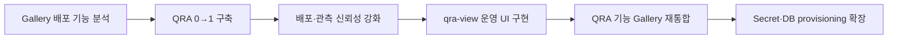

# QRA 프로젝트 정리

> [!abstract] 한 줄 정의
> QRA 프로젝트 리드로 GitOps 기반 배포 오케스트레이션·런타임 모니터링 플랫폼을 0→1로 구축하고, 백엔드부터 운영 프론트엔드까지 연결했다. 이후 QRA 기능을 Gallery에 재통합하면서 runtime Secret과 DB provisioning, lifecycle cleanup까지 구독 배포 자동화의 범위를 확장했다.

> [!warning] 확인이 필요한 사실
> `프로젝트 리드`는 본인 확인을 반영했다. 공식 프로젝트 기간, 팀 구성, 7개 EPIC·80개 이상 이슈 수치, 단독/공동 구현 범위는 외부 제출 전에 GitLab과 조직 자료로 한 번 더 확인한다.

## 프로젝트 개요

- **기간:** 2026.01.29 ~ 2026.05, 이후 Gallery 통합 확장
- **소속:** 넥스트리(Nextree) · Vizend 플랫폼
- **역할:** 프로젝트 리드, Backend/Frontend Engineer
- **목표:** Gallery에 있던 배포 기능을 독립 서비스 QRA로 분리하고, 구독 요청부터 GitOps 변경, ArgoCD/Kubernetes 관측, 결과 집계와 런타임 모니터링까지 하나의 플랫폼으로 구축
- **후속 변화:** 제품·서비스 경계 재조정에 따라 QRA 기능을 Gallery로 재통합하고 Secret·DB provisioning 자동화를 추가
- **주요 기술:** Java 21, Spring Boot, PostgreSQL, Flyway, Kafka, Kubernetes, Fabric8, ArgoCD, GitOps, React, TypeScript, SSE, Storybook, Vitest

## 전체 흐름

## 내가 맡은 책임

- 프로젝트 초기 PoC와 서비스 분리 범위 정의
- 배포 도메인, 모듈 구조, EPIC과 ADR 설계
- 구독 이벤트 기반 배포 오케스트레이션과 결과 집계 구현
- ArgoCD/Kubernetes 기반 배포 관측과 런타임 모니터링 설계·구현
- 동시성, 멱등성, 재시작 복구, 이벤트 전달 신뢰성 보강
- React/TypeScript 기반 qra-view 운영 화면과 상태 연동 구현
- QRA 기능의 Gallery 재통합 범위 결정과 코드·DB 마이그레이션
- Gallery 통합 이후 runtime Secret, DB provisioning, cleanup, E2E 자동화 확장
- 요구사항 정제, 이슈 분할, 리뷰와 검증 절차 운영

## 1. QRA 0→1 구축과 기술 리드

### 배경

Gallery 내부에 섞여 있던 배포 실행과 모니터링 책임을 독립 서비스로 분리해야 했다. GitOps, ArgoCD, Kubernetes, 메시징, 영속 상태가 연결되기 때문에 단순 코드 이동이 아니라 새로운 서비스 경계와 운영 모델이 필요했다.

### 행동

- Gitea, ArgoCD, k3d 기반 로컬 GitOps PoC를 먼저 구성해 기술 경로를 검증했다.
- `qra-domain`, `qra-feature`, `qra-facade`, `qra-proxy`, `qra-event`, `qra-store-jpa`, `qra-boot` 모듈의 책임을 정의했다.
- Gallery 구독 이벤트를 QRA 배포 요청으로 받아 GitOps 변경, ArgoCD sync, Kubernetes 관측, 결과 통지까지 이어지는 전체 흐름을 설계했다.
- EPIC과 ADR을 먼저 정의하고 구현·테스트·문서가 같은 경계를 따르도록 운영했다.

### 결과

- 구독 요청부터 배포 실행, 상태 관측, 결과 집계까지 이어지는 QRA의 전체 배포 사이클을 구축했다.
- 8주간 7개 핵심 EPIC을 완료하고 80개 이상의 이슈를 처리했다는 내부 기록이 있다. 외부 사용 전 수치 확인이 필요하다.
- 이후 QRA 기능을 Gallery로 다시 통합할 때 재사용할 수 있는 배포 도메인과 운영 자산을 남겼다.

## 2. 비동기 배포 파이프라인의 신뢰성 확보

### 배경

배포 요청은 메시지 재전달, 서버 재시작, 동일 서비스의 연속 배포, Git push와 ArgoCD 관측의 시간 차이 때문에 중복 실행과 상태 역전이 발생할 수 있었다. ArgoCD sync 성공만으로 실제 서비스 준비를 판단할 수도 없었다.

### 행동

- `requestId` 기반 중복 판정과 `NEW/DUPLICATE/CONFLICT` disposition을 구분했다.
- `deploymentGroupKey`, sequence, `Superseded` 상태로 이전 배포 관측을 중단하고 최신 요청이 승리하도록 만들었다.
- Batch Dispatch Lease와 queued GitOps processing으로 동일 배치의 중복 Git 작업을 방지했다.
- 서버 재시작 시 `Requested` 배포를 복구하고, 미완료 Git push payload를 재구성하도록 했다.
- 배포 성공 조건을 ArgoCD 상태와 개별 Deployment health, Kubernetes Pod의 연속 Ready 조건으로 구성했다.
- 결과 통지에는 Outbox 패턴을 적용하고 런타임 감시에는 leader election과 DB 기반 복구 흐름을 도입했다.

### 결과

- 재전달·재시작·연속 배포 상황에서도 하나의 요청이 여러 번 실행되거나 오래된 관측 결과가 최신 상태를 덮는 경로를 방어했다.
- 배포 성공을 sync 완료가 아니라 실제 워크로드 준비 상태까지 확인하는 기준으로 강화했다.
- 실패 시 Kubernetes Event를 필요한 시점에 조회해 운영자에게 더 구체적인 원인을 제공했다.

## 3. 런타임 모니터링과 qra-view 구현

### 배경

백엔드가 배포 상태를 정확히 계산해도 운영자가 진행 상황과 실패 원인을 이해할 화면이 없으면 실제 운영 도구로 쓰기 어렵다. Kubernetes 리소스 상태, GitOps desired/live 차이, 구독 단위 서비스 상태를 한 흐름에서 볼 필요가 있었다.

### 행동

- Fabric8 SharedInformer/cache 구조를 namespace 단위로 재편하고, 실패 시에만 Kubernetes Event를 보강하는 on-demand enrichment를 적용했다.
- SSE 기반 배포 진행 상태와 런타임 상태 스트리밍을 구성했다.
- qra-view에서 배포 목록·상세, 실시간 배포 모니터링, 구독별 런타임 상태를 구현했다.
- Kubernetes 리소스 토폴로지, resource detail, Manifest/Diff 확인 UI를 구현했다.
- GitOps Repository와 Container Registry 등록·연결 테스트 UI를 백엔드 API와 연결했다.
- Storybook 시나리오와 브라우저 기반 Vitest를 추가해 운영 UI의 주요 상태를 재현·검증했다.

### 결과

- 배포 요청, 진행 단계, Pod 상태, 실패 원인, 실제 리소스 구성을 한 운영 화면에서 추적할 수 있게 했다.
- 백엔드 상태 모델을 직접 프론트엔드 경험으로 연결해 API와 UI 사이의 의미 불일치를 줄였다.
- QRA 재통합 이후에도 관련 UI와 상태 모델이 `gallery-view`, `gallery-state`, `gallery-stub`으로 이어졌다.

## 4. QRA 기능의 Gallery 재통합

### 배경

제품 경계가 다시 조정되면서 독립 QRA 서비스의 배포 기능을 Gallery 내부로 통합해야 했다. 서비스 호출을 없애는 것만으로는 충분하지 않았고, facade·feature·domain·store·proxy와 데이터 스키마, 이벤트, 운영 문서를 함께 옮겨야 했다.

### 행동

- QRA 모듈의 facade, feature, domain, proxy, store-jpa 기능을 Gallery 구조에 맞춰 이관했다.
- QRA 엔티티용 Flyway migration을 멱등성을 고려해 통합하고 개발계 migration history 충돌을 해결했다.
- 기존 QRA API 경유 조회를 Gallery 내부 domain logic 호출로 바꿨다.
- 이관하지 않을 개발용 API와 Notification 경계를 명시적으로 제외했다.
- 중복 이벤트 경로와 중복 batch 생성 원인을 제거하고 main/release 반영까지 마무리했다.
- qra-view의 모델·API·컴포넌트를 Gallery 명명과 권한 구조에 맞게 이관했다.

### 결과

- QRA의 배포·관측 역량을 Gallery 내부 유스케이스로 흡수하면서 불필요한 서비스 간 호출을 제거했다.
- 코드뿐 아니라 Flyway, 로컬 검증 가이드, 역할 명명, 이슈·검증 방식까지 새 저장소 경계에 맞게 정리했다.

## 5. 구독 배포의 Secret·DB provisioning 확장

### 배경

구독형 서비스가 바로 기동되려면 workload manifest 외에도 애플리케이션 Secret과 DB/schema/role이 준비돼야 했다. 민감값을 GitOps 저장소나 이벤트 payload에 넣지 않으면서 배포 전에 Kubernetes Secret으로 만들어야 했고, 구독 해지 시 제거·보존 경계도 필요했다.

### 행동

- publisher의 `runtimePrerequisites.secrets` metadata와 구독자의 `subscriptionSecrets` value를 분리했다.
- Secret value를 subscription store에 암호화 저장하고, required·unknown·duplicate key를 서버에서 검증했다.
- 배포 직전에만 복호화해 Kubernetes Secret으로 적용하고 평문 Map을 비웠으며, 이벤트와 Git에는 value를 남기지 않았다.
- ArgoCD PreSync Hook과 Kubernetes Job으로 Bootstrap(DB 생성)과 Drama별 Schema Reconcile(schema·role·DB credential Secret)을 workload 이전 wave로 분리했다.
- runtime Secret, DB credential Secret, live PreSync hook resource는 ownership label로 정리하고 외부 DB/schema/role은 보존했다.
- SUBSCRIBE부터 Secret/DB 준비, 배포 관측, UNSUBSCRIBE와 cleanup까지 검증하는 full-lifecycle E2E를 구성했다.

### 결과

- 애플리케이션 배포와 별개였던 Secret·DB 준비를 구독 lifecycle 안에서 자동 실행·검증할 수 있게 했다.
- GitOps desired state, 클러스터 runtime 자산, 외부 데이터 자산의 cleanup 책임을 구분했다.
- 단위 테스트만으로 확인하기 어려운 GitOps–ArgoCD–Kubernetes–PostgreSQL 통합 경계를 12개 phase의 SUBSCRIBE→UNSUBSCRIBE E2E로 재현할 수 있게 했다.

## 기존 이력서 자료에서 보강한 근거

- 기존 경력기술서는 이 프로젝트의 핵심을 `이력서는 claim, 포트폴리오는 proof, 면접은 decision story`로 구분했다. 이 원칙은 현재 이직 프로젝트에서도 유지한다.
- 기존 자료에는 QRA/Gallery 역할을 `배포 인프라·플랫폼 백엔드 설계·구현 단독 주도`로 기록했다. 다만 Git 이력에 다른 기여자도 존재하므로 외부 문서에는 본인이 확인한 `프로젝트 리드`를 기본 표현으로 사용하고, 기능별 단독 구현만 별도로 확인한다.
- full-lifecycle 스크립트에는 fixture clean부터 SUBSCRIBE, Secret·DB 실체화, 완료 signal, UNSUBSCRIBE, prune와 cleanup 검증까지 12개의 phase가 확인된다.
- 포트폴리오에서는 PreSync manifest, Runtime Secret apply, lifecycle cleanup, E2E phase output을 실제 proof로 연결할 수 있다.

## 이력서용 핵심 문장

- QRA 프로젝트 리드로 GitOps 기반 배포 오케스트레이션 서비스를 0→1 구축하고, Gallery 구독 이벤트부터 GitOps 변경, ArgoCD/Kubernetes 관측, 배포 결과 집계까지 전체 파이프라인을 설계·구현했다.
- 서버 재시작 관측 복구, 중복·충돌 요청 구분, Superseded 전이, Batch Dispatch Lease, Outbox·leader election을 적용해 비동기 배포 파이프라인의 멱등성과 복구 가능성을 강화했다.
- React/TypeScript 기반 qra-view에서 실시간 배포 모니터링, 구독별 런타임 상태, Kubernetes 리소스 토폴로지, Manifest/Diff 조회 UI와 Storybook/Vitest 검증 체계를 구현했다.
- QRA 기능을 Gallery에 재통합하고, 구독 Secret 암호화 저장·Kubernetes 실체화, ArgoCD PreSync DB provisioning, label 기반 cleanup과 full-lifecycle E2E까지 자동화 범위를 확장했다.

## 지원 포지션별 강조점

| 포지션 | 앞에 둘 내용 | 줄일 내용 |
| --- | --- | --- |
| 백엔드 플랫폼 | 배포 lifecycle, 멱등성, 관측, 복구 | 세부 UI 스타일링 |
| 제품 백엔드 | 구독부터 배포까지 사용자 흐름, Secret/DB 자동화 | 내부 executor 세부 구현 |
| DevOps·SRE 성격 | ArgoCD/Kubernetes 관측, SharedInformer, E2E, cleanup | 도메인 모델 명명 |
| 테크리드 | 0→1 범위 설정, ADR/EPIC, 경계 재설계, 재통합 | 클래스·필드 이름 |
| 풀스택 | 백엔드 상태 모델과 qra-view 연결 | AI workflow 세부 절차 |

## 외부 제출 전 확인

- [ ] 공식 프로젝트 기간과 종료·재통합 시점
- [ ] 팀 인원과 내가 리드한 범위
- [ ] 7개 EPIC, 80개 이상 이슈 수치
- [ ] 단독 구현과 공동 구현을 구분할 항목
- [ ] 운영 환경 적용 범위와 실제 사용자
- [ ] 수동 작업 감소, 배포 시간, 장애 감소 등 측정 가능한 결과
- [x] full-lifecycle E2E 12개 phase - 스크립트 확인 완료

## 근거

### Obsidian

- [[vizend-qra|Vizend QRA]] - 프로젝트 허브와 기술 스택
- [[2026-W05 vizend-qra]] - PoC와 프로젝트 킥오프
- [[2026-W06 vizend-qra]] - ArgoCD observation 도입
- [[2026-W07 vizend-qra]] - 재시작 복구와 동시성 보호
- [[2026-W08 vizend-qra]] - 런타임 모니터링과 장애 감지
- [[2026-W10 vizend-qra]] - Gallery 이벤트 통합과 결과 집계
- [[2026-W11 vizend-qra]] - Outbox와 leader election
- [[2026-W12 vizend-qra]] - SharedInformer와 Event enrichment
- [[gallery-qra-resume-summary]] - Gallery 확장 작업의 raw 조사 자료
- [[포트폴리오 구성]] - 이력서 claim과 공개 가능한 proof 연결

### 로컬 저장소

- `/Users/taez/Projects/nextree/vizend/qra-backend`
- `/Users/taez/Projects/nextree/vizend/vizend-monorepo`
- `/Users/taez/Projects/nextree/vizend/gallery`

## 연결된 노트

- [[경력 원장]] - 검증된 경력 사실
- [[성과 사례]] - 면접과 이력서에 재사용할 CAR 사례
- [[이력서]] - 제출용 압축 문장
- [[면접 준비]] - QRA 설명과 후속 질문
- [[포트폴리오 구성]] - 코드·ADR·E2E 증거 구성
