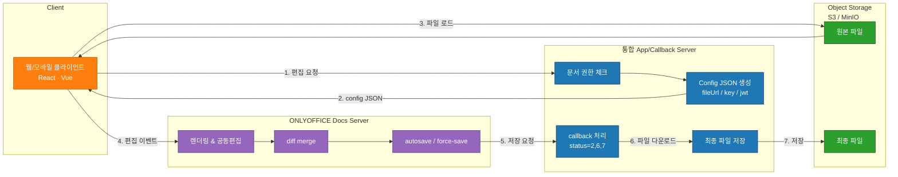
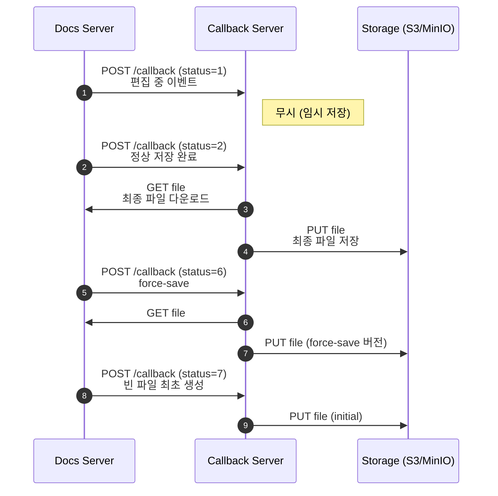
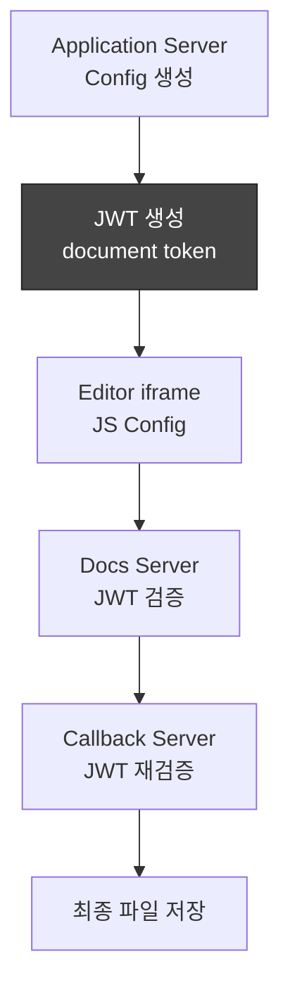

# ONLYOFFICE 연동

> [!note] 현재 상태
> 지금은 보류 중인 프로젝트다. 재개할 때는 이 노트의 아키텍처와 아래 발행 시리즈부터 확인한다.

## 발행 시리즈

- [[ONLYOFFICE 01 - 그냥 문서 편집기인 줄 알았는데|1편: ONLYOFFICE 개요와 통합 구조]]
- [[ONLYOFFICE 02 - Antigravity와 함께한 Vibe Coding기|2편: 기본 연동 구현]]
- [[ONLYOFFICE 03 - key와 메타데이터 관리|3편: key와 메타데이터 관리]]
- [[ONLYOFFICE 04 - SDK, MinIO, Saga|4편: SDK, MinIO, Saga]]

## 아키텍처 개요

### 전체 아키텍처 흐름 (편집 요청 → 편집 → 저장 콜백)

---

### 콜백 서버 상세 시퀀스 (status별 처리 흐름)

---

### JWT & Security 구조

