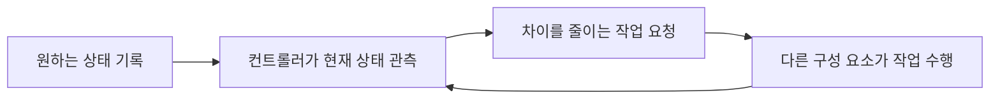

# Kubernetes의 원하는 상태와 실제 상태

애플리케이션을 세 개 실행하고 싶다고 하자. 명령을 한 번 보내 세 개를 만드는 것만으로는 이후 하나가 사라졌을 때 세 개를 유지할 수 없다. Kubernetes의 선언적 관리는 **유지할 상태를 기록하고 실제 상태와의 차이를 계속 줄이는 방식**이고, 이 반복을 [조정(reconciliation)](https://kubernetes.io/docs/concepts/architecture/controller/)이라 부른다.

## 원하는 상태는 spec에, 관측한 상태는 status에

Deployment 같은 워크로드 객체는 `spec`에 원하는 설정을 적는다. `replicas: 3`은 원하는 복제본 수이고 Pod template에는 이미지와 컨테이너 설정이 들어간다. `status`에는 컨트롤러가 관측해 보고한 진행 상황이 담긴다. 둘은 갱신 시점이 다르므로 설정을 바꾼 직후부터 상태가 같을 것이라고 기대하면 안 된다.

`kubectl apply`가 성공했다는 것은 API가 변경을 받아들였다는 뜻이다. 노드에 자리를 배정하고 이미지를 내려받고 컨테이너를 띄우는 일은 그 뒤에 일어난다. API 요청이 성공해도 이미지 오류나 자원 부족으로 원하는 상태에 도달하지 못할 수 있다.

그림은 단순화한 것이다. 실제로는 컨트롤러 하나가 모든 일을 하지 않는다. [Deployment 컨트롤러](https://kubernetes.io/docs/concepts/workloads/controllers/deployment/)는 ReplicaSet을 관리하고, ReplicaSet 컨트롤러는 Pod 수를 맞추며, 스케줄러와 kubelet이 각자의 몫을 한다.

## 복제본 수와 사용 가능 여부는 다른 질문이다

세 개를 원하는데 Pod가 두 개뿐이면 추가 생성이나 스케줄링을 막는 조건을 찾는다. Pod는 세 개인데 하나가 이미지를 못 받으면 이미지 이름·접근 권한·레지스트리 연결을 본다. 컨테이너는 실행 중인데 준비 상태가 아니면 준비 조건을 본다. 세 상황은 관측한 값이 다르고 봐야 할 곳도 다르다.

Pod가 존재하거나 컨테이너가 실행 중이라는 것만으로 요청을 받을 준비가 됐다고 볼 수 없다. [readiness probe](https://kubernetes.io/docs/concepts/workloads/pods/probes/)를 설정했다면 그 결과가 준비 상태를 정한다. probe가 확인하는 범위가 좁으면 통과했다고 모든 업무 기능이 정상이라고 결론 내릴 수도 없다.

## 자동 조정에도 한계가 있다

컨트롤러는 차이를 줄이려 하지만 어떤 설정이든 결국 성공시키지는 않는다. 없는 이미지를 지정했다면 이미지를 고치거나 자원을 준비해야 한다. 계속 대기 중이면 원하는 값, 관측한 상태, Event와 로그를 나란히 놓고 진행이 막힌 지점을 찾는다.

조정의 대상도 객체마다 다르다. Deployment의 이미지 변경과 별도 Secret 객체의 값 변경은 같은 변화가 아니다. 어떤 객체를 바꿨는지, 그 변화를 소비하는 쪽이 어떻게 반영하는지까지 봐야 한다. [[K8s envFrom Secret은 Pod 재기동 없이 갱신되지 않는다|Secret 적용은 성공했지만 실행 중인 환경변수는 바뀌지 않는 문제]]가 그 예다.
