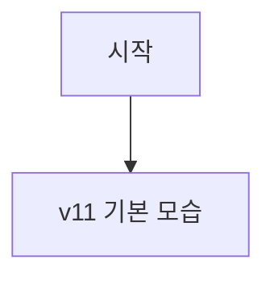
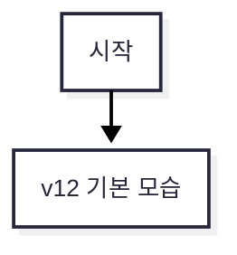
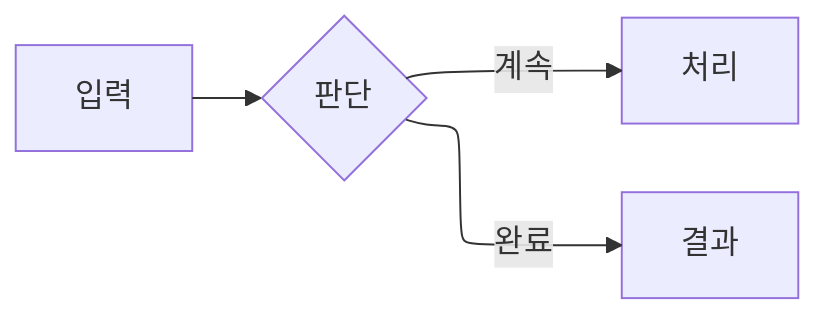
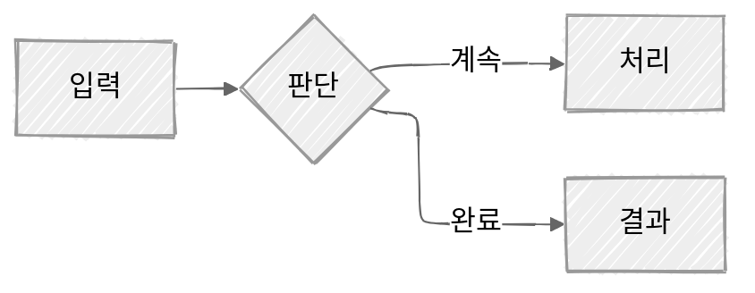
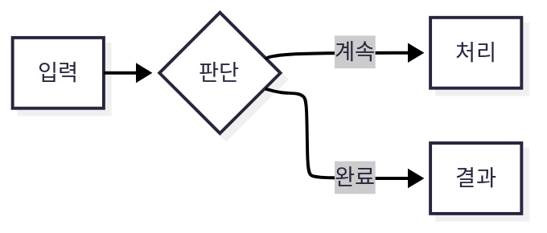
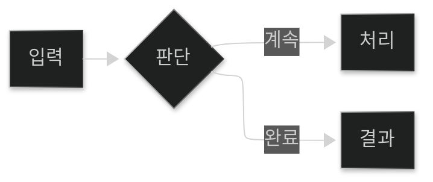
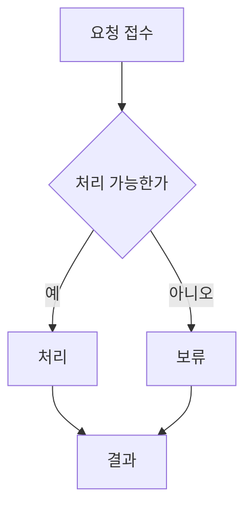
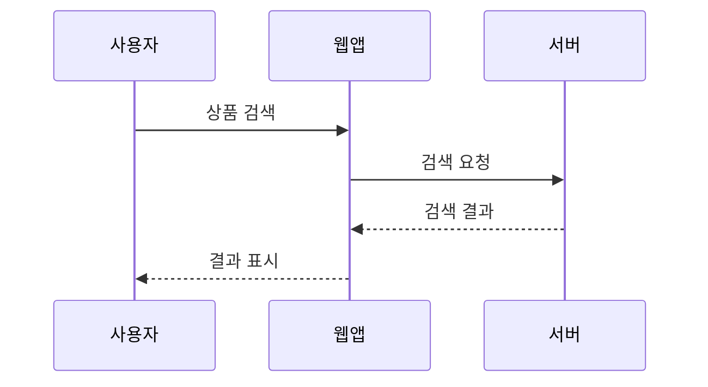
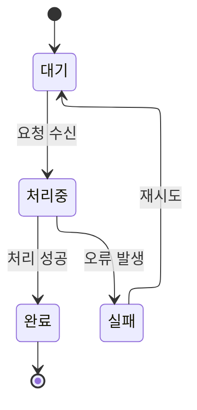

# Mermaid 12의 변경 사항

생각 정원의 Mermaid 버전을 11에서 12로 올리면서 알게 된 변경 사항들을 정리한다. 기존 일부 다이어그램의 기본 배치와 색, 외형이 달라진 이유와 새로 추가된 다이어그램에 관한 내용도 정리한다.

## Mermaid 12에서 먼저 달라지는 것

[Mermaid 12.0.0 릴리스 노트](https://github.com/mermaid-js/mermaid/releases/tag/mermaid@12.0.0)에 따르면 기본값의 큰 변화는 세 가지다.

Mermaid 12에서는 일부 다이어그램의 기본값이 `layout: elk`, `theme: redux-color`, `look: neo`로 바뀐다.

| 항목  | Mermaid 11까지 | Mermaid 12 기본값           | 사용자에게 보이는 변화          |
| --- | ------------ | ------------------------ | --------------------- |
| 배치  | `dagre`      | `elk`                    | 노드와 간선의 위치가 달라질 수 있다. |
| 테마  | `default`    | `redux-color` (일부 다이어그램) | 요소의 색이 역할별로 나뉠 수 있다.  |
| 외형  | `classic`    | `neo` (일부 다이어그램)         | 둥근 모서리와 부드러운 그림자 적용   |

`ELK`는 노드와 간선의 자리를 계산하는 배치 엔진이다. Mermaid 12에는 ELK가 포함되고, 일부 다이어그램에서 기본 배치 엔진으로 사용된다. 기본값 적용 범위는 다이어그램 종류에 따라 다르므로 [테마 설정 문서](https://mermaid.js.org/config/theming)와 [레이아웃 문서](https://mermaid.js.org/config/layouts)에서 확인한다.

생각 정원은 Mermaid 12로 렌더링하지만 Obsidian의 내장 Mermaid 버전은 아직 올라오지 않았으므로 사이트와 볼트에서의 다이어그램은 다르게 보일 수 있다.

### v11과 12의 차이 비교

<div class="diagram-comparison">

<div class="diagram-case">

<h4>Mermaid 11까지</h4>



</div>

<div class="diagram-case">

<h4>Mermaid 12</h4>



</div>

</div>

> [!tip] 이전 모양을 유지하려면
> 기존 모양을 유지하려면 `frontmatter`에 이전 버전의 기본값을 명시한다.
> 
> ```yaml
> config:
>    layout: dagre
>    theme: default
>    look: classic
> ```

## 룩과 테마

`look`은 도형의 표현 방식이고 `theme`은 색과 기본 스타일을 정한다. Mermaid가 기본 제공하는 `look`은 `classic`, `handDrawn`, `neo` 세 가지다. v12에서는 일부 다이어그램의 기본 룩과 테마가 `neo`와 `redux-color`로 바뀌었다.

### 대표 조합

`classic + default`는 전통적인 Mermaid 스타일, `handDrawn + neutral`은 손그림과 흑백 조합, `neo + redux-color`는 Mermaid 12의 기본 조합이다.

<div class="diagram-comparison is-stacked">

<div class="diagram-case">

<h4><code>classic + default</code></h4>



</div>

<div class="diagram-case">

<h4><code>handDrawn + neutral</code></h4>



</div>

<div class="diagram-case">

<h4><code>neo + redux-color</code></h4>



</div>

<div class="diagram-case">

<h4><code>neo + dark</code></h4>



</div>

</div>

> [!note] 생각의 정원에서 사용하는 설정
> Mermaid는 사용자가 커스터마이징 할 수 있는 `base` 테마를 제공한다. 생각의 정원에도 처음엔 `base`를 적용했다가 뭔가 밋밋해서 `redux-color`를 바탕으로 사이트 전용 컬러 팔레트를 사용하는 방법으로 변경했다.

## 대표 다이어그램

Mermaid로 다양한 관계와 흐름을 표현할 수 있다. 대표적인 다이어그램은 다음과 같다.

| 문법 | 잘 맞는 설명 |
| --- | --- |
| `flowchart` | 순서, 분기, 반복, 의사결정 |
| `sequenceDiagram` | 참여자 사이의 시간순 호출과 응답 |
| `stateDiagram-v2` | 상태와 상태 사이의 전이 |
| `classDiagram` | 클래스와 타입 사이의 구조적 관계 |
| `erDiagram` | 데이터 엔티티와 관계 |
| `mindmap` | 한 주제에서 뻗어 나가는 계층적 생각 |
| `gitGraph` | 브랜치, 병합, 릴리스 흐름 |

흐름도는 순서, 분기, 반복을 표현한다.



시퀀스 다이어그램은 참여자 사이의 요청과 응답을 시간순으로 표현한다.



상태도는 객체나 작업의 상태 전이를 표현한다.



## 12에서 추가된 다이어그램

Mermaid 12에는 `usecase-beta`와 `agentflow-beta`가 추가됐다. 둘 다 `beta`이므로 문법이 바뀔 수 있다. 정원에는 Mermaid 12가 적용되어 아래 다이어그램이 렌더링되지만 Obsidian에서는 아직 표현되지 않는다.

### `usecase-beta`

액터(사용자나 외부 서비스)와 시스템 안의 기능 사이의 관계를 나타낸다.

```mermaid
---
config:
  layout: elk
---
usecase-beta
direction LR
actor Customer("고객")
actor Operator("운영자")
actor PaymentService("결제 서비스")
systemBoundary Shop["온라인 쇼핑몰"]
  Search("상품 검색")
  Cart("장바구니에 담기")
  Order("주문하기")
  Pay("결제하기")
  History("주문 내역 확인")
  Manage("상품 관리")
end
Customer --> Search
Customer --> Cart
Customer --> Order
Customer --> History
PaymentService --> Pay
Operator --> Manage
Order ..> : include Pay
```

### `agentflow-beta`

`agentflow-beta`는 에이전트가 수행하는 작업과 사용하는 도구·참고 자료를 흐름으로 나타내고, 단계 사이의 제어와 데이터 이동을 표현한다. 순서, 참고, 실패 경로는 각각 다른 연결선으로 나타낸다.

```mermaid
---
config:
  layout: elk
---
agentflow-beta
  global
    policy["답변 작성 규칙"]@{ shape: refdoc }
    source["제품 문서와 참고 자료"]@{ shape: refdoc }
  end

  flow writer["자료 기반 답변 에이전트"]
    request["사용자 질문"]@{ shape: input }
    retrieve["관련 자료 검색"]@{ shape: tool, params: "질문 :: String", returns: "근거 목록" }
    draft["답변 초안 작성"]@{ shape: task }
    review["근거가 충분한가?"]@{ shape: decision }
    revise["부족한 근거 보완"]@{ shape: task }
    send["답변 전송"]@{ shape: action }

    request --> retrieve --> draft --> review
    retrieve -.- source
    draft -.- policy
    review -- 통과 --> send
    review --x revise
    revise --> draft
  end
  writer@{ instruction: "근거가 확인된 내용만 답변으로 만든다." }
```

## 참고 자료

- [Mermaid 12.0.0 릴리스 노트](https://github.com/mermaid-js/mermaid/releases/tag/mermaid@12.0.0)
- [Use case diagrams](https://mermaid.js.org/syntax/usecase.html)
- [Agentflow diagram](https://mermaid.js.org/syntax/agentflow.html)
- [Diagram Syntax](https://mermaid.js.org/intro/syntax-reference.html)

## 연관된 노트

- [[생각의 정원을 만들고 배포하는 과정]] - Mermaid 다이어그램이 사이트 페이지로 나가는 경로와 적용 기록
