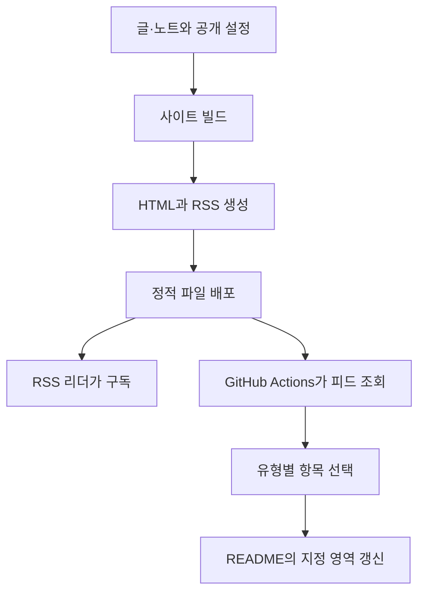

# RSS로 글을 전달하고 GitHub Actions로 프로필을 갱신하기

개인 사이트에 글을 올릴 때마다 GitHub 프로필의 최근 글 목록도 직접 고쳐야 할까? 사이트가 읽기 쉬운 목록을 제공하고, 프로필 쪽에서 그 목록을 가져오면 두 곳에 같은 내용을 관리하지 않아도 된다.

사이트는 **무엇을 공개할지**, GitHub Actions는 **그중 무엇을 프로필에 보여줄지** 결정한다. 이 두 책임을 나누면 같은 피드를 RSS 리더와 프로필 갱신에 함께 사용할 수 있다.

## RSS는 목록을 전달하는 형식이다

RSS(Really Simple Syndication)는 콘텐츠 목록을 XML로 전달하는 형식이다. `channel`은 피드 전체, `item`은 개별 글이나 노트를 나타낸다. 피드를 읽는 프로그램은 사이트 화면을 분석하는 대신 제목·주소·날짜 같은 정해진 필드를 읽는다. [RSS 2.0 명세](https://www.rssboard.org/rss-specification)

RSS 파일을 만든 것만으로 구독자에게 알림이 전송되지는 않는다. 여기서는 RSS 리더나 GitHub Actions가 주기적으로 파일을 가져오는 방식을 사용한다. 사이트는 같은 피드를 여러 소비자에게 제공할 수 있고, 소비자는 각자 표시할 개수와 갱신 주기를 정한다.



사이트의 RSS 갱신과 프로필의 갱신은 서로 다른 실행이다. RSS가 새로 배포돼도 프로필은 다음 Actions 실행 전까지 이전 목록을 보여줄 수 있다.

## 사이트와 자동화의 책임을 나눈다

| 담당 | 하는 일 |
| --- | --- |
| 사이트의 공개 자료 수집 | 공개 대상 글과 노트를 선별한다. |
| RSS 생성 | 선별된 자료에서 제목·요약·날짜·주소를 뽑고 XML로 직렬화한다. |
| 사이트 배포 | RSS 파일을 외부에서 가져갈 수 있게 제공한다. |
| 프로필의 GitHub Actions | 피드를 읽고 항목 수와 표시 형식을 정해 README를 갱신한다. |

RSS 구현이 원본 노트 폴더를 다시 훑으며 독자적인 공개 규칙을 만들면, 사이트 화면에는 없는 자료가 피드에 들어갈 수 있다. 사이트와 RSS가 같은 공개 자료 목록을 사용하도록 구성하면 이 불일치를 줄일 수 있다. RSS에는 목적에 따라 본문 전체 또는 요약을 담을 수 있다. 최근 글을 안내하는 용도라면 제목·주소·요약으로 충분하다. 요약을 본문에서 자동 추출한다면 그 발췌도 공개 범위에 포함해 검토한다.

Astro의 정적 엔드포인트는 빌드 시점에 파일을 생성한다. `src/pages/rss.xml.js`에서 `GET` 함수를 내보내 XML을 담은 `Response`를 반환하면 `rss.xml`이 만들어진다. 별도 API 서버를 계속 실행할 필요는 없다. [Astro 정적 엔드포인트](https://docs.astro.build/en/guides/endpoints/#static-file-endpoints)

## 날짜와 링크는 피드의 의미를 결정한다

외부에 발행한 글과 사이트에 직접 올린 생각 노트를 함께 제공한다면 다음처럼 기준을 정할 수 있다. 이는 RSS 규격이 강제하는 조건이 아니라 피드의 목적에 맞춘 설계 선택이다.

| 항목 | 포함 조건 | 날짜 | 클릭 시 이동 |
| --- | --- | --- | --- |
| 글 | 발행 완료 상태이며 발행일과 발행 주소가 있음 | 외부 발행일 | 회사 블로그·Velog·Brunch 등 원래 발행처 |
| 생각 노트 | 사이트 공개 대상이며 허브·목차 성격의 노트가 아님 | 최초 공개일 또는 명시적으로 선택한 기록 날짜 | 사이트의 노트 상세 페이지 |

피드를 제공하는 사이트와 개별 항목이 가리키는 사이트는 달라도 된다. 개인 사이트에서 글 목록을 관리하면서 `item.link`에는 원래 발행처를 넣을 수 있다. 발행일이나 주소가 없는 글은 목록에서 제외하거나 별도 기준으로 처리하되, 작성일을 발행일처럼 표시하거나 링크를 임의로 대체하지 않는다.

다음은 필드를 설명하기 위한 예시이며 실제 발행 글은 아니다.

```xml
<item>
  <title>실패한 작업을 다시 시작하는 방법</title>
  <link>https://example.com/articles/retry</link>
  <guid isPermaLink="true">https://example.com/articles/retry</guid>
  <pubDate>Sun, 06 Sep 2026 00:00:00 +0900</pubDate>
  <category>글</category>
  <description>작업 상태와 재시도 경계를 정리한 글.</description>
</item>
```

- `link`는 읽으러 갈 주소다.
- `guid`는 항목을 구별하는 식별자다. 링크를 식별자로 사용할 수도 있다. 주소가 바뀌면 일부 리더가 새 항목으로 볼 수 있으므로 URL을 안정적으로 유지하는 것이 좋다.
- `pubDate`는 항목의 발행 날짜다. 날짜만 있는 자료라면 시간대와 시각을 정해 RSS 날짜 형식으로 변환해야 한다. 예를 들어 한국 시간 자정으로 정할 수 있지만, 이것을 실제 발행 시각으로 해석하면 안 된다.
- `category`로 글과 노트를 구분한다.

필드의 의미와 `guid`를 통한 새 항목 판별은 [RSS item 명세](https://www.rssboard.org/rss-specification#hrelementsOfLtitemgt)에 설명돼 있다.

**작성일·최초 공개일·수정일은 서로 다르다.** 오래전에 쓴 노트를 오늘 공개했다면 작성일 기준으로는 최근 목록 위에 나타나지 않는다. 수정일을 기준으로 삼으면 오탈자만 고쳐도 새 기록처럼 올라올 수 있다.

피드가 ‘새로 공개한 기록’을 뜻한다면 최초 공개일을 따로 관리하는 편이 정확하다. 작성일을 대신 사용한다면 그 한계를 설명하고, 빌드 시각이나 파일 수정 시각으로 매번 날짜를 바꾸지 않는다.

## 통합 피드와 프로필용 피드를 분리한 이유

프로필에 글 2개와 노트 1개를 보여주고 싶다고 하자. 통합 피드에서 최근 3개만 가져오면 모두 노트일 수 있다. 통합 피드의 최근 30개를 먼저 잘라 둔 뒤 유형별로 고르는 방식도, 노트가 많으면 글이 이미 빠져 있을 수 있다.

그래서 **유형을 먼저 고르고, 그 안에서 날짜순으로 정렬한 뒤 개수를 제한**한다.

| 경로 | 용도 |
| --- | --- |
| `/rss.xml` | 글과 노트를 함께 읽는 통합 구독, 최근 30개 |
| `/feeds/posts.xml` | 글만 읽는 피드, 최근 30개 |
| `/feeds/notes.xml` | 생각 노트만 읽는 피드, 최근 30개 |

프로필에서는 글 피드에서 2개, 노트 피드에서 1개를 가져온다. 각 유형의 자료가 부족하면 있는 만큼만 표시하며 개수를 채우려고 다른 자료를 넣지 않는다.

일반 RSS 리더가 사이트 주소에서 피드를 찾도록 공통 HTML의 `head`에도 발견 정보를 둔다.

```html
<link rel="alternate" type="application/rss+xml"
      title="글과 생각 노트"
      href="https://example.com/rss.xml" />
```

이 태그는 피드 위치를 알려준다. 실제 RSS 파일을 생성하거나 배포하는 역할은 하지 않는다.

## GitHub Actions는 README의 일부만 갱신한다

예를 들어 `blog-post-workflow` 액션은 RSS를 읽어 README의 주석 마커 사이를 갱신한다. `feed_list`는 피드 주소, `max_post_count`는 개수, `comment_tag_name`은 갱신할 영역을 지정한다. [blog-post-workflow 공식 README](https://github.com/gautamkrishnar/blog-post-workflow#options)

다음은 **공개된 RSS를 읽는 설정 예시**다. `example.com`은 사용할 피드 주소로 바꾼다. 사이트가 하위 경로에 배포된다면 그 경로까지 포함해야 한다.

README에는 두 영역을 둔다.

```markdown
## 최근 남긴 글과 생각

<!-- GARDEN-POSTS:START -->
<!-- GARDEN-POSTS:END -->

<!-- GARDEN-NOTES:START -->
<!-- GARDEN-NOTES:END -->
```

워크플로는 같은 작업에서 두 피드를 각각 읽는다. 아래는 액션의 `v1` 인터페이스를 사용하는 예시다.

```yaml
name: Update garden entries

on:
  schedule:
    - cron: "17 0 * * 1"
  workflow_dispatch:

permissions:
  contents: write

jobs:
  update-readme:
    runs-on: ubuntu-latest
    steps:
      - uses: actions/checkout@v4
      - name: 최근 글 2개
        uses: gautamkrishnar/blog-post-workflow@v1
        with:
          feed_list: "https://example.com/feeds/posts.xml"
          max_post_count: 2
          comment_tag_name: "GARDEN-POSTS"
          tag_post_pre_newline: true
          template: "- [글] [$title]($url)$newline"
      - name: 최근 생각 노트 1개
        uses: gautamkrishnar/blog-post-workflow@v1
        with:
          feed_list: "https://example.com/feeds/notes.xml"
          max_post_count: 1
          comment_tag_name: "GARDEN-NOTES"
          tag_post_pre_newline: true
          template: "- [노트] [$title]($url)$newline"
```

`contents: write`는 README 변경을 저장소에 반영하기 위한 권한이다. `workflow_dispatch`는 수동 실행, `schedule`은 정기 실행에 사용한다. 위 cron은 UTC 월요일 00:17, 한국 시간 월요일 09:17이다. 예약 실행은 기본 브랜치를 기준으로 하며, 정확한 시각의 실행을 보장하지는 않는다. [GitHub Actions 실행 이벤트](https://docs.github.com/en/actions/reference/workflows-and-actions/events-that-trigger-workflows#schedule)

## 피드 생성과 프로필 갱신을 따로 검증한다

RSS 파일을 생성할 수 있다는 것과 프로필이 정상 갱신된다는 것은 다른 결과다. 다음 순서로 확인하면 실패한 구간을 좁힐 수 있다.

1. **생성:** XML을 파싱할 수 있는지, 공개 대상만 들어가는지, 날짜·식별자·유형별 개수 제한이 맞는지 확인한다. 제목과 요약의 `&`, `<` 같은 문자도 XML 규칙에 맞게 처리해야 한다.
2. **배포:** RSS 주소를 가져올 수 있는지, 글과 노트 링크가 의도한 페이지로 연결되는지 확인한다.
3. **소비:** Actions를 수동 실행해 README의 지정 영역만 갱신되고, 글·노트의 개수와 링크가 의도대로 표시되는지 확인한다.

사이트의 공개 기준, RSS의 날짜와 링크, 소비자의 선택 규칙을 각각 확인해야 화면과 프로필이 서로 다른 내용을 보여주는 이유를 추적할 수 있다.
