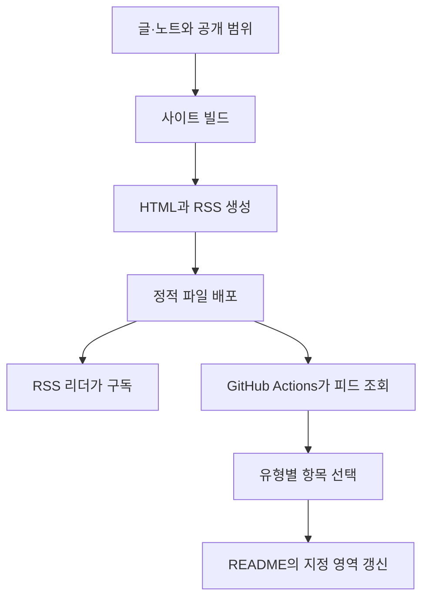

# RSS로 글을 전달하고 GitHub Actions로 프로필을 갱신하기

개인 사이트에 글을 올릴 때마다 GitHub 프로필의 최근 글 목록도 손으로 고쳐야 할까. 사이트가 목록을 RSS로 내고 프로필 쪽 워크플로가 그 목록을 가져오면 같은 내용을 두 곳에서 관리하지 않아도 된다. 사이트는 무엇을 공개할지, 워크플로는 그중 무엇을 프로필에 보여줄지를 맡는다. 책임을 이렇게 나누면 같은 피드를 RSS 리더와 프로필 갱신에 함께 쓸 수 있다.



RSS 갱신과 프로필 갱신은 서로 다른 실행이다. RSS가 새로 배포돼도 프로필은 다음 워크플로 실행까지 이전 목록을 보여준다.

## 피드는 사이트와 같은 공개 목록에서 만든다

RSS 생성이 원본 노트 폴더를 따로 훑으며 자기만의 공개 규칙을 갖게 두면 사이트 화면에는 없는 자료가 피드에 들어갈 수 있다. 사이트와 RSS가 같은 공개 자료 목록을 쓰게 한다. 최근 글을 알리는 용도라면 제목·주소·요약이면 충분하고, 요약을 본문에서 자동 발췌한다면 그 발췌도 공개 범위 안에서 검토한다.

Astro에서는 [정적 엔드포인트](https://docs.astro.build/en/guides/endpoints/#static-file-endpoints)가 빌드 때 파일을 만든다. `pages/rss.xml.js`에서 `GET`을 내보내 XML을 담은 `Response`를 돌려주면 `rss.xml`이 생기고, 별도 서버는 필요 없다.

## 날짜와 링크가 피드의 뜻을 정한다

외부에 발행한 글과 사이트에 직접 올린 노트를 한 피드에 담을 때는 기준을 정해 두어야 한다. RSS 규격이 강제하는 것이 아니라 피드의 목적에 맞춘 선택이다.

| 항목 | 포함 조건 | 날짜 | 클릭 시 이동 |
| --- | --- | --- | --- |
| 글 | 발행 완료 상태이며 발행일과 발행 주소가 있음 | 외부 발행일 | 원래 발행처 |
| 생각 노트 | 사이트 공개 대상이며 허브·목차 성격의 노트가 아님 | 최초 공개일 또는 명시적으로 고른 기록 날짜 | 사이트의 노트 페이지 |

피드를 내는 사이트와 항목이 가리키는 사이트는 달라도 된다. 글 목록은 개인 사이트가 관리하면서 `link`에는 원래 발행처를 넣을 수 있다. 발행일이나 주소가 없는 글은 빼거나 별도 기준으로 다루되, 작성일을 발행일처럼 표시하거나 링크를 임의로 대체하지 않는다.

```xml
<item>
  <title>실패한 작업을 다시 시작하는 방법</title>
  <link>https://example.com/articles/retry</link>
  <guid isPermaLink="true">https://example.com/articles/retry</guid>
  <pubDate>Sun, 06 Sep 2026 00:00:00 +0900</pubDate>
  <category>글</category>
  <description>작업 상태와 재시도 경계를 정리한 글.</description>
</item>
```

- `link`는 읽으러 갈 주소, `guid`는 항목을 구별하는 식별자다. 링크를 식별자로 써도 되지만 주소가 바뀌면 리더가 새 항목으로 보므로 URL을 안정적으로 유지한다.
- `pubDate`는 발행 날짜다. 날짜만 있는 자료는 시간대와 시각을 정해 RSS 날짜 형식으로 바꿔야 한다. 한국 시간 자정으로 정할 수 있지만 그것이 실제 발행 시각은 아니다.
- `category`로 글과 노트를 구분한다. 필드의 뜻과 `guid`로 새 항목을 가리는 규칙은 [RSS item 명세](https://www.rssboard.org/rss-specification#hrelementsOfLtitemgt)에 있다.

작성일·최초 공개일·수정일은 다르다. 오래전에 쓴 노트를 오늘 공개했다면 작성일 기준으로는 최근 목록에 올라오지 않는다. 수정일을 쓰면 오탈자만 고쳐도 새 기록처럼 올라온다. 피드가 "새로 공개한 기록"을 뜻한다면 최초 공개일을 따로 관리하는 편이 정확하다. 작성일을 대신 쓴다면 그 한계를 알고, 빌드 시각이나 파일 수정 시각으로 날짜를 매번 바꾸지는 않는다.

## 피드를 유형별로 나눈 이유

프로필에 글 2개와 노트 1개를 보여주고 싶다고 하자. 통합 피드에서 최근 3개만 가져오면 셋 다 노트일 수 있다. 통합 피드의 최근 30개를 자른 뒤 유형별로 골라도 노트가 많으면 글이 이미 빠져 있다. 그래서 유형을 먼저 고르고 그 안에서 날짜순으로 정렬한 뒤 개수를 제한한다.

| 경로 | 용도 |
| --- | --- |
| `/rss.xml` | 글과 노트를 함께 읽는 통합 구독, 최근 30개 |
| `/feeds/posts.xml` | 글만 읽는 피드, 최근 30개 |
| `/feeds/notes.xml` | 생각 노트만 읽는 피드, 최근 30개 |

프로필은 글 피드에서 2개, 노트 피드에서 1개를 가져온다. 부족하면 있는 만큼만 보여주고 다른 유형으로 채우지 않는다.

RSS 리더가 사이트 주소에서 피드를 찾도록 공통 HTML의 `head`에 발견 정보도 둔다. 이 태그는 위치만 알려 줄 뿐 파일을 만들거나 배포하지는 않는다.

```html
<link rel="alternate" type="application/rss+xml"
      title="글과 생각 노트"
      href="https://example.com/rss.xml" />
```

## GitHub Actions는 README의 표시 영역만 갱신한다

[`blog-post-workflow`](https://github.com/gautamkrishnar/blog-post-workflow#options) 액션은 RSS를 읽어 README의 주석 마커 사이를 갱신한다. `feed_list`는 피드 주소, `max_post_count`는 개수, `comment_tag_name`은 갱신할 영역이다.

README에 두 영역을 둔다.

```markdown
## 최근 남긴 글과 생각

<!-- POSTS:START -->
<!-- POSTS:END -->

<!-- NOTES:START -->
<!-- NOTES:END -->
```

같은 작업에서 두 피드를 각각 읽는다. `example.com`은 실제 피드 주소로 바꾸고, 사이트가 하위 경로에 배포된다면 그 경로까지 넣는다.

```yaml
name: Update garden entries

on:
  schedule:
    - cron: "17 0 * * 1"
  workflow_dispatch:

permissions:
  contents: write

jobs:
  update-readme:
    runs-on: ubuntu-latest
    steps:
      - uses: actions/checkout@v4
      - name: 최근 글 2개
        uses: gautamkrishnar/blog-post-workflow@v1
        with:
          feed_list: "https://example.com/feeds/posts.xml"
          max_post_count: 2
          comment_tag_name: "POSTS"
          tag_post_pre_newline: true
          template: "- [글] [$title]($url)$newline"
      - name: 최근 생각 노트 1개
        uses: gautamkrishnar/blog-post-workflow@v1
        with:
          feed_list: "https://example.com/feeds/notes.xml"
          max_post_count: 1
          comment_tag_name: "NOTES"
          tag_post_pre_newline: true
          template: "- [노트] [$title]($url)$newline"
```

`contents: write`는 README 변경을 저장소에 반영하는 권한이다. 위 cron은 UTC 월요일 00:17, 한국 시간 월요일 09:17이다. [예약 실행](https://docs.github.com/en/actions/reference/workflows-and-actions/events-that-trigger-workflows#schedule)은 기본 브랜치 기준이며 정확한 시각을 보장하지는 않는다.

## 생성·배포·소비를 따로 확인한다

RSS 파일이 만들어진다는 것과 프로필이 갱신된다는 것은 다른 결과다. 생성 단계에서는 XML이 파싱되는지, 공개 대상만 들어갔는지, 날짜·식별자·개수 제한이 맞는지, 제목·요약의 `&`와 `<`가 이스케이프됐는지를 본다. 배포 단계에서는 피드 주소가 열리고 항목 링크가 의도한 페이지로 가는지를 본다. 소비 단계에서는 워크플로를 수동 실행해 README의 지정 영역만 바뀌고 개수와 링크가 맞는지를 본다. 화면과 프로필이 다른 내용을 보여줄 때 이 셋 중 어디서 갈렸는지 좁힐 수 있다.
